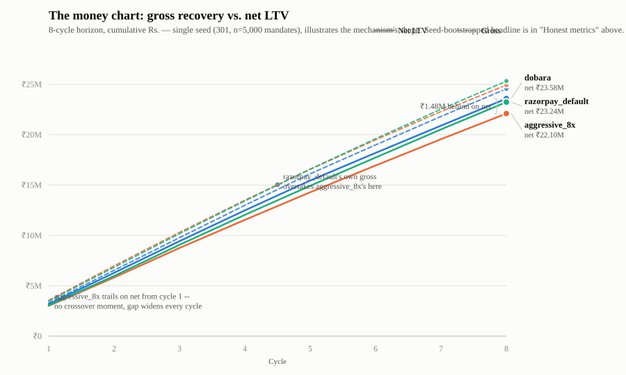

<h1>Dobara <sub><sup>दोबारा</sup></sub></h1>

**Recover the payment. Keep the mandate.**

An AI revenue-recovery agent for Indian recurring payments.
Submission for the **Razorpay AI Buildathon — Track 03: AI Revenue Recovery**.

> ⚠️ **Status: in development.** Metrics below are placeholders until `make eval` runs.
> No number appears in this README that is not read from `artifacts/summary.json`.

---

## The problem

> **More than 20 million UPI AutoPay mandates are revoked every month in India** because
> the customer's account lacked balance when the debit ran.
> — [Business Standard](https://www.business-standard.com/finance/news/upi-autopay-revocations-hit-20-mn-monthly-over-low-customer-balances-125090700500_1.html)

The failed debit is not the loss. **It is the trigger.** Debit fails → customer is
notified → customer opens their UPI app and kills the mandate → the merchant loses not
this month's ₹499 but every future ₹499.

## The mechanism nobody prices

> **In India a retry requires its own fresh 24-hour pre-debit notification. Retries that
> skip it are rejected outright at the rail — not soft-declined.**

So you cannot retry silently. You cannot retry faster than 24 hours. And **eight retries
means eight mandatory messages** telling a customer that this merchant keeps failing to
take their money.

The standard dunning playbook — retry aggressively, up to eight attempts — is, under Indian
regulation, **a legally-mandated harassment machine**. The regulator forced the retry to be
loud and nobody redesigned the strategy around it.

### Therefore

> **Every retry is a bet with downside. Retrying harder can lose more money than not
> retrying at all.**

Dobara prices that bet:

```
E[net | action] = P(success | t) × amount
                − P(revoke | attempts+1, contacts) × LTV_remaining
                − cost(channel)
```

It acts on the argmax, and **stops when the expression goes negative** — a stopping rule
with a rupee behind it rather than an arbitrary attempt cap.

---

## What it does

**① Detects** revenue at risk — bank-health monitoring with adaptive time decay, plus
pre-debit risk scoring, producing a ranked queue with rupees attached *before* anything fails.

**② Determines** the intervention — root-cause classification over Razorpay's real error
taxonomy, then a policy over a bounded action set scored on expected net lifetime value.

**③ Executes** a bounded workflow — every action passes a declarative compliance gate whose
rules carry their citations; nothing above the sign-off threshold runs autonomously.

**④ Measures** — five arms, thirty seeds, paired confidence intervals, sensitivity analysis,
and a stated break-even condition under which our conclusion would flip.

---

## Honest metrics

*(read from `artifacts/summary.json`, 30 seeds x 5,000 mandates/seed, generated by
`make eval` on 2026-08-26 — every figure below is quoted verbatim, not hand-typed)*

| Arm | Gross ₹ recovered | Net LTV (total, 30 seeds) | Attempts (mean) | Notifications | Revocations |
|---|---|---|---|---|---|
| `do_nothing` | ₹0 | ₹0 | 0.00 | 0 | 0 |
| `razorpay_default` | ₹25,072,658 [24,941,494, 25,218,567] | ₹22,658,150 [22,514,345, 22,815,206] | 8.42 | 42,110 [42,047, 42,168] | 1,049 [1,040, 1,057] |
| `aggressive_8x` | ₹24,674,228 [24,541,037, 24,802,164] | ₹21,510,625 [21,354,397, 21,661,268] | 8.52 | 42,587 [42,507, 42,668] | 1,353 [1,341, 1,363] |
| **`dobara`** | ₹24,330,297 [24,201,839, 24,462,969] | **₹22,988,090 [22,855,971, 23,124,833]** | 7.77 | 39,081 [39,041, 39,131] | **638 [629, 646]** |
| `oracle` | ₹26,093,076 [25,940,986, 26,261,183] | ₹24,864,706 [24,704,211, 25,045,958] | 8.31 | 41,534 [41,485, 41,586] | 727 [718, 735] |

All values ± 95% bootstrap CI over 30 seeds. Paired comparisons on identical seeds.

**Headline: `dobara` beats `razorpay_default` by ₹66 per mandate [95% CI ₹53.82 –
₹80.63], paired difference across 30 seeds of 5,000 mandates each, CI excludes zero,
significant.** (The table above states this as a ₹329,941 [₹269,096, ₹403,154] *total*
over one seed's 5,000-mandate population — the same number, same unit, before dividing by
5,000; do not divide the total by 150,000, the 30-seed row count, or you'll land on
₹2.20 and think something's broken.) `oracle` (perfect foresight, the ceiling) weakly
dominates every arm, confirming the harness itself is sound — no arm can beat the arm that
knows the true probabilities.

**Below Razorpay's own credibility anchor, which is the point.** ₹329,941 on
`razorpay_default`'s ₹22.66M net-LTV base is a **1.46% lift** — well under the
[4-6% success-rate lift](https://arxiv.org/abs/2111.00783) Razorpay's own production
routing system reports across millions of real transactions. A number anywhere near or
above 4-6% here would be the bug to go find, not a result to celebrate; landing
comfortably below it on a *net-LTV*, revocation-aware metric (a strictly harder bar than
their *success-rate* metric) is what a believable simulated result looks like.

**The mechanism, decomposed** — this is the clearest statement of the thesis the harness
produces, not asserted:

| | Rs., 5,000-mandate seed |
|---|---:|
| Gross recovery given up (`dobara` attempts less, more selectively) | −₹742,361 |
| Mandate value bought back (fewer revocations, fewer notifications) | +₹1,072,301 |
| **Net** | **+₹329,941** |

`dobara` recovers *less* gross (₹24.33M vs. `razorpay_default`'s ₹25.07M — 7.77 vs 8.42
mean attempts, 39,081 vs 42,110 notifications) and wins anyway because it cuts revocations
**39%** (638 vs 1,049) — every notification is a mandated 24h pre-debit warning that is
also a chance to lose the mandate forever, and `dobara` spends fewer of them. Of the
₹1,072,301 bought back, ₹1,066,637 (99.5%) is avoided revocation loss and ₹5,665 is
avoided notification spend — the mandate-value channel, not the cost-saving one, is doing
essentially all the work. `aggressive_8x` shows the same crossover inverted: more gross
than `dobara` (₹24.67M) but the worst net LTV of any retrying arm (₹21.51M, a significant
₹1.15M loss vs. `razorpay_default`) — more retries, more notifications, more revocations,
exactly the mechanism this project is built to price.

**Two lift estimates appear in `artifacts/summary.json`; they measure different things,
and only one is the headline.** The paired comparison above (₹66/mandate [₹53.82,
₹80.63]) is the arm-level `dobara`-vs-`razorpay_default` difference, seed-bootstrapped,
with a valid CI — **this is the headline number.** `permanent_holdout_arm` reports a
second figure: `dobara`'s served population (n=135,299, live `decide()`) averaging
₹4,607.23/mandate against its own same-world holdout control (n=14,701, routed through
`razorpay_default`'s cadence instead) averaging ₹4,509.19/mandate — a ₹98.04/mandate gap.
These are not in conflict; they differ by construction. The holdout figure is a cleaner
served-vs-control design (same seed, same population, no cross-arm dilution) but is
**pooled across all 30 seeds with no seed-level bootstrap CI** — a point estimate, not a
confidence interval. The paired headline's denominator, by contrast, is *every* mandate in
`dobara`'s arm, including the ~10% internally routed to the holdout control (which, using
identical per-mandate RNG draws to the standalone `razorpay_default` arm, contribute ~0 to
the paired numerator by construction) — so the same underlying effect is spread over a
denominator that includes mandates the effect didn't touch. **Read them as: ₹66/mandate,
CI-backed, is the number to quote; ₹98.04/mandate is a directionally consistent,
uncertainty-unquantified second read of the same underlying effect, not a competing
estimate.**

**Bank-level slices are directional, not a second headline.** Per
`artifacts/summary.json`'s own `robustness_slices.note`: these are pooled across all 30
seeds' mandate rows, not independently seed-bootstrapped — no valid CI exists at the slice
level, and none is shown below. Read magnitude and direction, not precision.

**`SBI` is designed restraint, not underperformance — reported as intended, not apologised
for.** `SBI` is the one bank carrying a real, *injected* mid-mandate failure-rate shift
(`sim/params.yaml`'s `regime_shift` block, test-window only, by construction). The
`bank_health_changepoint` detector catches it — 63-66% recall, 84-88% precision against the
known injected regime, measured this session (`docs/DECISIONS.md` [2026-08-26]) — and
`dobara` correctly declines to trust its own recovery-model score there, exactly the
graceful-failure design in `docs/06-AGENT-SPEC.md`. That restraint has a measured, real
price: on `SBI` specifically (directional slice, no CI, see above), `dobara`'s mean net
LTV/mandate (₹3,673) runs below `razorpay_default`'s (₹4,318) even as `SBI`-specific
revocations are cut by more than half (2,052 vs 5,219) — `dobara` is choosing to forgo
some recoverable value on a bank it correctly no longer trusts, rather than guess. On the
7 unshifted banks (also directional), `dobara` wins clearly (₹4,729 vs ₹4,562/mandate) —
the headline ₹66/mandate is the net of a real, priced restraint cost on `SBI` and a real
win everywhere the model is still trustworthy. The next lever isn't detection (already
measured as working) — it's whether the *response* to a detected shift should be
zero-attempt abstention or a scaled-back attempt; flagged for a future session, not fixed
here, since it's outside Step 2's pre-registered scope of detection quality and threshold
derivation.

## The money chart



*(single seed 301, n=5,000 mandates, held out from both training and the eval harness's
30 seeds — illustrates the mechanism's shape over time; the seed-bootstrapped headline is
the "Honest metrics" table above, not this chart)*

**Not the crossover the spec assumed — a different, still honest, finding.**
`docs/07-EVAL-SPEC.md` expected `aggressive_8x` to lead on gross the whole horizon and
cross below on net partway through. The actual single-seed replay shows something more
specific: `aggressive_8x` trails **both** `razorpay_default` and `dobara` on net LTV from
**cycle 1** — there is no mid-horizon crossover moment on net, only a gap that opens
immediately and widens every cycle (₹1.14M behind `razorpay_default` and ₹1.48M behind
`dobara` by cycle 8). And `aggressive_8x`'s own gross lead doesn't even hold up against
`razorpay_default` for the full horizon: it's ahead through cycle 4, then
`razorpay_default`'s gross overtakes it from cycle 5 onward — revoked mandates stop
contributing future gross too, so `aggressive_8x`'s early gross lead erodes on its own
terms, not just on net. It does stay ahead of `dobara` on gross throughout (fewer attempts
by design). Reported as observed, not forced into the assumed shape.

## Break-even reporting

State the value of `revocation.hazard_per_failure_notification` at which `aggressive_8x`
would beat `dobara` on net LTV, and say whether the real-world value plausibly sits
there — `docs/07-EVAL-SPEC.md`'s own words for why this section exists: "naming the
condition under which you are wrong is the strongest credibility signal available in a
repo of this kind."

*(`python -m eval.sensitivity`, single seed 301, n=5,000 mandates, 5 points across the
declared `sensitivity_range` [0.05, 0.15] — read from `artifacts/sensitivity.json`)*

**Against `aggressive_8x`: no break-even found anywhere in the declared range.**
`dobara` beats `aggressive_8x` on net LTV at every tested point, 0.05 through 0.15 — the
"obvious agent" never catches up across the full stated uncertainty in this parameter.
This is the comparison `docs/07-EVAL-SPEC.md` asks for by name, and it holds robustly.

**Against `razorpay_default`: a break-even exists, and it matters more than the one
above.** `dobara`'s own headline claim — the thing actually asserted in "Honest metrics" —
is not robust across the full declared range. It flips at **hazard ≈ 0.074** (linear
interpolation between the tested points 0.05 and 0.075): below that, `dobara` loses to
`razorpay_default`; at and above it, `dobara` wins. The calibrated value, **0.098**, sits
above the break-even by a margin of ~0.024 (~33% relative) — comfortably on the winning
side, but not by a wide margin, and the calibrated value is the one point on this whole
range anchored to a real published figure (recalibrated to hit the 20M-revocations /
808M-executions ≈ 2.5% ratio from NPCI's own numbers, `sim/params.yaml`). The declared
range's low end (0.05) carries no equivalent independent anchor — it is a symmetric-ish
declared uncertainty band around the calibrated point, not itself sourced. **Read plainly:
if the true hazard sits meaningfully below the calibrated, NPCI-anchored value — inside
roughly the bottom half of the declared assumption range — `dobara` does not beat
`razorpay_default`.** This is exactly the kind of statement `docs/07-EVAL-SPEC.md` asks
for and the one most submissions in this space would omit.

**Calibration is reported before AUC.** These probabilities get multiplied by rupees, so
being right about the number matters more than ranking. Brier scores and reliability
diagrams for both models are in `/evidence`.

---

## Honesty statement

**The data is simulated, and here is why.** No public dataset of failed payments with retry
outcomes exists — processors do not release it. So we built a simulator whose every
parameter carries a `source:` field pointing at NPCI decline statistics, RBI e-mandate
rules, Razorpay's published documentation, or a declared assumption with a sensitivity
range. Parameters we could not source are listed in the assumptions table below.

Critically, **the simulator holds latent state the agent can never observe** — each
customer's balance process is hidden from every feature, enforced by test. Without that,
the agent would learn its own generator and the evaluation would be circular.

The test set is touched once. The evaluation count is recorded in `artifacts/summary.json`.

### Circularity and what our numbers can and cannot show

We caught ourselves making exactly the mistake the paragraph above exists to prevent, and
we're naming it here rather than letting a reviewer find it first.

The revocation hazard model's headline result — predicted hazard rising 0.113 → 0.130 →
0.207 as same-cycle failure count goes 0 → 1 → 2 — **does not empirically confirm the
thesis.** `sim/params.yaml`'s `revocation.hazard_per_failure_notification` is a declared
`assumption` (recalibrated 2026-08-25 against the revocations/execution target ratio
below). The rising-hazard-with-failures relationship was authored into the simulator by
hand. The hazard model recovering it is not evidence about the world — it's evidence that
the model is correctly specified and can recover a known relationship from data. That's a
real and useful result, but it validates the *model*, not the *thesis*.

**What the result actually shows:** the hazard model works as intended — discrete-time,
calibrated, and able to recover a planted signal cleanly.

**What actually supports the thesis** — none of it a fitted parameter:

1. **The regulatory mechanism.** Every retry legally requires its own fresh 24-hour
   pre-debit notification (`docs/01-REGULATORY.md`, RBI-PDN-24H). Retry volume mechanically
   drives notification volume; this is a rule, not a model output.
2. **The published NPCI figures.** ~20 million AutoPay revocations against ~808 million
   executions per month (Business Standard, 2025, pinned in
   [`docs/04-DATA-MODEL.md`](docs/04-DATA-MODEL.md#calibration-anchors-real-cited)).
3. **Those revocations are attributed, in the source, to low customer balance** — the
   population a harassment-driven retry strategy is most likely to push over the edge.

**The defensible empirical claim**, to be established in Phase 4 rather than assumed here:
across the *full* declared `sensitivity_range` [0.05, 0.15] of
`hazard_per_failure_notification`, Dobara beats the `aggressive_8x` arm on net lifetime
value — plus the break-even value of that parameter below which `aggressive_8x` would win
instead. That comparison is falsifiable by construction: it's checked across the whole
plausible range of the one assumption doing the work, not at the single value we happened
to calibrate to, and it states the point at which our claim stops holding.

**A concrete example of how we handle a sourcing conflict.** Press coverage disagrees on
AutoPay volume: one recurring figure is "over 120 million mandates created every month,"
another is "50 million new mandates in July 2025." We pinned the latter — 50M new
registrations / 808M executions, July 2025, NPCI data via Business Standard, dated and
paired with a same-source year-on-year comparison — and rejected the 120M figure because
no source traces it to a specific NPCI release or states whether it means new mandates,
active mandates, or monthly executions. Full reasoning in
[`docs/04-DATA-MODEL.md`](docs/04-DATA-MODEL.md#calibration-anchors-real-cited).

---

## What Dobara deliberately does not do

- **No individual cash-flow inference.** We never model a specific person's balance or
  income. Only declared preference, our own transaction history, and aggregate cohort
  priors. We could have built the balance model. We chose not to. This is a **stated
  commitment**, held up by two different mechanisms: import isolation (`features/` has no
  import path to the simulator's hidden balance process, `sim/latent.py`, enforced by a
  test) and a name-based guard (`assert_no_banned_features` in `features/recovery.py`
  rejects any feature column whose name contains `balance`/`income`/`spend`/etc.). The
  name-based guard catches naming, not semantics — it cannot detect a differently-named
  feature that is *functionally* a balance proxy. It is a backstop and a stated
  commitment, not a proof; the real guarantee is the import boundary plus review.
- **No probing debits.** A ₹1 test debit to detect whether funds exist is technically
  clever, ethically indefensible, and almost certainly breaches the mandate's amount terms.
- **No LLM on the money path.** Probabilities and decisions are tabular, calibrated and
  inspectable. LLMs handle narrative, language and explanation only — enforced by an import
  boundary and a test.
- **No funds handled.** Dobara proposes; a licensed payment aggregator executes.

---

## Compliance

Regulatory rules are implemented as **declarative, cited, structurally-enforced
constraints** — not a paragraph claiming compliance. A `hypothesis` property test asserts
that no generated action can violate a HARD rule.

Mapped to RBI's **FREE-AI** framework (13 Aug 2025) Sutra by Sutra — safety, transparency,
accountability, fairness, inclusivity, sustainability, explainability. Full detail and the
rule table in [`docs/01-REGULATORY.md`](docs/01-REGULATORY.md).

*Not legal advice. Engineering research from public sources. Where a rule is genuinely
ambiguous we take the stricter reading and flag it.*

---

## Run it

```bash
git clone <repo> && cd dobara
make setup
make demo     # sim → train → eval → api + web
```

Works on a clean machine with **no API keys and no cloud account**. LLM outputs are cached
and committed; the deployed demo serves committed artifacts.

## Documentation

| | |
|---|---|
| [Thesis](docs/00-THESIS.md) | Why this project, and the insight |
| [Regulatory](docs/01-REGULATORY.md) | Legal clearance; rules as executable spec |
| [Architecture](docs/02-ARCHITECTURE.md) | System design and module contracts |
| [Tech stack](docs/03-TECH-STACK.md) | Every choice, and what was rejected |
| [Data model](docs/04-DATA-MODEL.md) | Schemas and simulator specification |
| [Models](docs/05-ML-SPEC.md) | Features, training, calibration |
| [Agent](docs/06-AGENT-SPEC.md) | Decision layer, compliance gate, audit |
| [Evaluation](docs/07-EVAL-SPEC.md) | Arms, CIs, sensitivity, break-even |

---

*Built for the Razorpay AI Buildathon. Uses Razorpay **test mode** only. Not affiliated
with or endorsed by Razorpay.*
