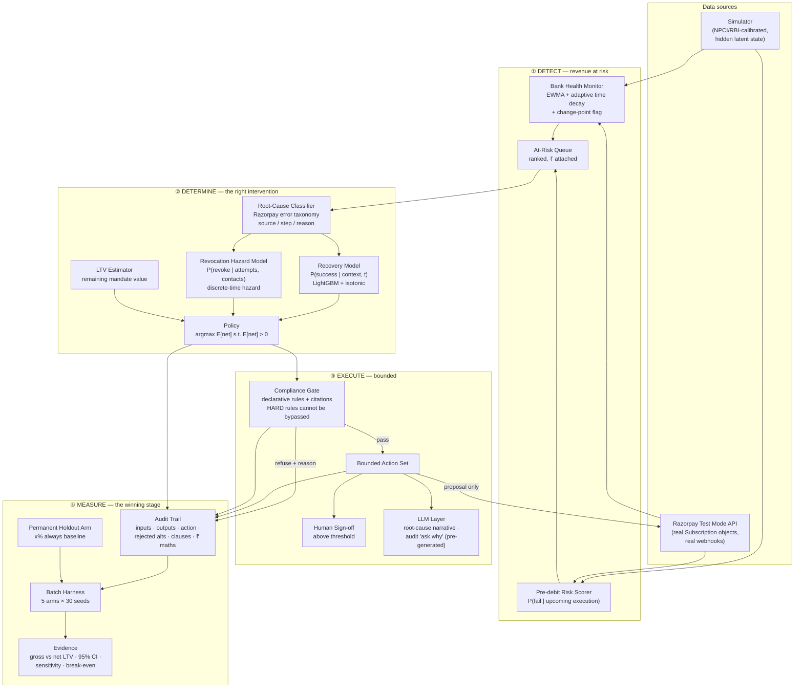

<h1>Dobara <sub><sup>दोबारा</sup></sub></h1>

**Recover the payment. Keep the mandate.**

An AI revenue-recovery agent for Indian recurring payments.
Submission for the **Razorpay AI Buildathon — Track 03: AI Revenue Recovery**.

## What I built

Every retry of a failed recurring payment in India legally requires its own 24-hour
warning message. Dobara treats each retry as a priced bet against losing the mandate
entirely, rather than a free action — and it beats Razorpay's own default retry policy
on net value recovered while cutting mandate revocations from 1,049 [95% CI 1,040,
1,057] to 638 [629, 646] per seed (Honest metrics, below). It's a working system: a simulator, three
trained/calibrated ML models, a structurally-enforced compliance gate, a full audit
trail, and a batch evaluation harness — not a slide deck.

**Live: [dobara-one.vercel.app](https://dobara-one.vercel.app)** — the three strongest
reads for a judge short on time: [`/`](https://dobara-one.vercel.app) (the thesis and a
real mandate's aggressive-vs-Dobara replay), [`/evidence`](https://dobara-one.vercel.app/evidence)
(the full result, CIs, sensitivity and break-even), [`/architecture`](https://dobara-one.vercel.app/architecture)
(the LLM boundary and the compliance gate, plus a short note from me). Two worked
decisions if you want to go deeper: [`/audit/89`](https://dobara-one.vercel.app/audit/89)
(rejected alternatives and all) and [`/audit/144`](https://dobara-one.vercel.app/audit/144)
(an abstain — the agent declining to guess).

The rest of this README goes deep on method, and volunteers its own limitations —
[jump straight there](#the-mechanism-nobody-prices) if that's what you're here for, or
keep reading for how it was built and how to run it.

## A note from the builder

I'm Jay Gautam, and I built this alone for this submission. The thing I'm most honest
about: partway through, I found that 76% of the agent's decisions were landing on an
exact tie at the top of its scoring — silently broken by loop order, not by any real
rule, because an isotonic probability calibrator was too coarse to preserve a day-of-week
signal the underlying model had genuinely learned. I diagnosed the actual cause before
touching a fix, wrote down a commitment to report the headline result honestly either
way *before* rerunning it, and then reran — the number moved by ₹0.28 per mandate, not a
regression, but I didn't know that going in. Full account in
[`docs/DECISIONS.md`](docs/DECISIONS.md) under `[2026-08-27]`, "Three findings from a
static review."

## How this was built

**Stack, and why:** Python (uv, LightGBM + isotonic calibration, pandas) for the
simulator, models, and agent — tabular and inspectable was a requirement, not a
preference, so nothing here reaches for a neural net where a calibrated GBM does the
job. Next.js (App Router, static export) for the frontend, because the deployed demo
needed to run with no server and no API key — every route reads committed JSON
artifacts, never a live model call. FastAPI exists for local development
(`make api`) but the deployed site doesn't depend on it. Full reasoning for every choice,
including what was rejected and why, is in
[`docs/03-TECH-STACK.md`](docs/03-TECH-STACK.md).

**Deliberately not built:** no real-time serving path (the demo is batch and
artifact-driven — a real deployment would need one), no multi-merchant tenancy, no
handling of actual funds movement (Dobara proposes, a licensed aggregator would
execute), and no live LLM call in production (narratives are pre-generated offline; see
the "ask why" section below for why).

**What would come next with more time:** the `SBI`-slice finding in the metrics
below — Dobara correctly detects a bank-specific failure-rate shift but currently
responds by abstaining entirely rather than scaling back attempts, which is safe but
leaves recoverable value on the table; deciding between those two responses is scoped
out of this submission but flagged in `docs/DECISIONS.md` as the next real lever. Beyond
that: a real (not simulated) calibration dataset, and testing the compliance gate
against RBI's FREE-AI framework with an actual compliance reviewer rather than my own
reading of the primary sources.

> No number appears in this README that is not read from `artifacts/summary.json`.

## Run it

```bash
git clone https://github.com/jaygautam-creator/Dobara && cd Dobara
make setup
make demo     # sim → train → eval → api + web
```

Works on a clean machine with **no API keys and no cloud account**. LLM outputs
(`artifacts/llm_cache/ask_why.json`) are pre-generated and committed; the deployed demo
and this clone both serve committed artifacts, never a live model call.

Regenerating the ask-why cache itself is the one step that needs a key, and it's optional
— everything else runs without it:

```bash
GROQ_API_KEY=... make ask-why   # or GEMINI_API_KEY=...
```

Resumable: only fills in decisions missing from the cache, so an interrupted run picks
back up rather than re-spending calls already made.

---

## The full method

Everything below is the detailed, falsifiable case for the headline result — including
where it's weakest. Volunteering the limitations is the point: read on if you want to
audit the claim rather than take it on faith.

---

## The problem

> **More than 20 million UPI AutoPay mandates are revoked every month in India** because
> the customer's account lacked balance when the debit ran.
> — [Business Standard](https://www.business-standard.com/finance/news/upi-autopay-revocations-hit-20-mn-monthly-over-low-customer-balances-125090700500_1.html)

The failed debit is not the loss. **It is the trigger.** Debit fails → customer is
notified → customer opens their UPI app and kills the mandate → the merchant loses not
this month's ₹499 but every future ₹499.

## The mechanism nobody prices

> **In India a retry requires its own fresh 24-hour pre-debit notification. Retries that
> skip it are rejected outright at the rail — not soft-declined.**

So you cannot retry silently. You cannot retry faster than 24 hours. And **eight retries
means eight mandatory messages** telling a customer that this merchant keeps failing to
take their money.

The standard dunning playbook — retry aggressively, up to eight attempts — is, under Indian
regulation, **a legally-mandated harassment machine**. The regulator forced the retry to be
loud and nobody redesigned the strategy around it.

### Therefore

> **Every retry is a bet with downside. Retrying harder can lose more money than not
> retrying at all.**

Dobara prices that bet:

```
E[net | action] = P(success | t) × amount
                − P(revoke | attempts+1, contacts) × LTV_remaining
                − cost(channel)
```

It acts on the argmax, and **stops when the expression goes negative** — a stopping rule
with a rupee behind it rather than an arbitrary attempt cap.

---

## What it does

**① Detects** revenue at risk — bank-health monitoring with adaptive time decay, plus
pre-debit risk scoring, producing a ranked queue with rupees attached *before* anything fails.

**② Determines** the intervention — root-cause classification over Razorpay's real error
taxonomy, then a policy over a bounded action set scored on expected net lifetime value.

**③ Executes** a bounded workflow — every action passes a declarative compliance gate whose
rules carry their citations; nothing above the sign-off threshold runs autonomously.

**④ Measures** — five arms, thirty seeds, paired confidence intervals, sensitivity analysis,
and a stated break-even condition under which my conclusion would flip.

### Architecture, in one frame



Money decisions (the `POL` policy node) never pass through the LLM layer — enforced by an
import boundary, not just convention (`tests/test_no_llm_in_money_path.py`). Full module
contracts: [`docs/02-ARCHITECTURE.md`](docs/02-ARCHITECTURE.md).

---

## The calibrator experiment — the strongest finding in this repo, reported as one

**This is a shipped decision with the losing alternative published in full, not hidden.**
`main` runs the isotonic calibrator below (every number in "Honest metrics" reflects it).
A full, measured alternative — Platt scaling on the recovery model, adopted per a
pre-registered rule, fully evaluated, diagnosed, then reverted — lives permanently on
[`experiment/platt-calibrator`](https://github.com/jaygautam-creator/Dobara/tree/experiment/platt-calibrator).
Nothing about it is deleted, softened, or moved out of view.

**The result, stated directly:** we replaced the calibrator with one that scored
*better* on the pre-registered proxy metric (Brier score, held-out, CI-overlap
confirmed) and cut the argmax tie rate — the fraction of decisions where the calibrator
couldn't distinguish candidate dates, forcing `agent/decide.py`'s restraint-first
tie-break to pick instead — from **77.2% to 17.9%**. Net LTV vs. `razorpay_default`
moved from **+₹65.71/mandate** [+₹53.31, +₹80.27] to **−₹64.09/mandate**
[−₹81.50, −₹48.65], CI excluding zero, 30 paired seeds. The new configuration was
**strictly dominated**, not a trade-off: it recovered *less* gross (−₹376,733) AND
revoked *more* mandates (+78.7, +12.3%).

**Checked as a possible bug before being accepted as a finding.** The recovery model's
underlying booster is bit-identical between configurations (only the calibrator
changed); Platt is strictly monotone and stays in-range; no unrelated code change
reaches the money path. A specific causal hypothesis — that Platt's inability to emit
near-zero probabilities makes hopeless retries look artificially profitable — was
tested directly and **did not hold up**: of the 19 decisions (out of 1,312 checked)
where isotonic abstained/stopped and Platt acted instead, the lowest `p_success`
involved was 0.243 — nowhere near Platt's ~0.116 floor. That claim was dropped, not
kept, because the evidence didn't support it. What the same check found instead:
**50.9% of decisions kept the same action but changed the chosen debit date, and 100%
of those date changes were later under Platt than the tie-break's "earliest legal
date" rule chose under isotonic** (median +7 days). Date selection, not abstention, is
where the reversal lives — why later dates net out worse in aggregate is an open
question, not chased further. Full diagnostic, every check, every number:
`docs/DECISIONS.md` [2026-09-02].

**The implication, stated directly, because it's the strongest thing this project has
to show:** the restraint-first tie-break (`agent/decide.py::_tie_break_score`) is not a
fallback compensating for a weak model. It is **load-bearing**. Handing the date
decision to a more confidently-calibrated model — on a metric (Brier) that improved —
destroyed value on the metric the whole system exists to optimize. That is not a claim
about restraint being good design in the abstract; it is a measurement, on this
project's own agent, in both directions, with both results kept.

**Both configurations, side by side** (`dobara` arm, per-5,000-mandate seed, mean
across 30 seeds — full detail and every other arm-level metric measured:
`docs/DECISIONS.md` [2026-09-02]):

| Metric | Isotonic (shipped, `main`) | Platt (`experiment/platt-calibrator`) | Delta |
|---|---:|---:|---:|
| Net LTV vs. `razorpay_default` | **+₹65.71/mandate** (win) | **−₹64.09/mandate** (loss) | −₹129.80 |
| Argmax tie rate (held-out) | 77.2% | 17.9% | −59.3pp |
| Gross recovered (₹, total) | 24,328,993 | 23,952,261 | −376,733 |
| Revocations (per seed) | 637.7 | 716.4 | +78.7 (+12.3%) |
| Abstentions (per seed) | 1,952.6 | 1,720.6 | −232.0 (−11.9%) |
| Decisions with a changed date | — | 50.9% (668/1,312), 100% later, median +7 days | — |

**Why isotonic ships.** The pre-registration bound adoption to two calibration proxies
(Brier-CI overlap, tie-rate-halved) and both were genuinely beaten by Platt — the
proxies did their job. But the pre-registration was under-specified: it never named net
LTV, the actual thesis metric, as a criterion. This is "the rule was incomplete," not
"the rule said no" — stated plainly, not disguised as rule-following. Full disclosure
and reasoning: `docs/DECISIONS.md` [2026-09-02].

---

## Honest metrics

*(read from `artifacts/summary.json`, 30 seeds x 5,000 mandates/seed, generated by
`make eval` on 2026-08-27 (rerun after `agent/decide.py`'s tie-break fix,
`docs/DECISIONS.md` [2026-08-27] — the 2026-08-26 run this table quoted before is
superseded, not because it was found wrong, but because it was measured under a policy
that no longer exists) — every figure below is quoted verbatim, not hand-typed)*

| Arm | Gross ₹ recovered | Net LTV (total, 30 seeds) | Attempts (mean) | Notifications | Revocations |
|---|---|---|---|---|---|
| `do_nothing` | ₹0 | ₹0 | 0.00 | 0 | 0 |
| `razorpay_default` | ₹25,072,658 [24,941,494, 25,218,567] | ₹22,658,150 [22,514,345, 22,815,206] | 8.42 | 42,110 [42,047, 42,168] | 1,049 [1,040, 1,057] |
| `aggressive_8x` | ₹24,674,228 [24,541,037, 24,802,164] | ₹21,510,625 [21,354,397, 21,661,268] | 8.52 | 42,587 [42,507, 42,668] | 1,353 [1,341, 1,363] |
| **`dobara`** | ₹24,328,993 [24,200,557, 24,461,022] | **₹22,986,684 [22,855,497, 23,123,587]** | 7.77 | 39,082 [39,042, 39,131] | **638 [629, 646]** |
| `oracle` | ₹26,093,076 [25,940,986, 26,261,183] | ₹24,864,706 [24,704,211, 25,045,958] | 8.31 | 41,534 [41,485, 41,586] | 727 [718, 735] |

All values ± 95% bootstrap CI over 30 seeds. Paired comparisons on identical seeds. Only
`dobara`'s row moved from the pre-rerun table (the other four arms never call
`agent/decide.py`, so the tie-break fix cannot touch them — confirmed bit-identical).

**Headline: `dobara` beats `razorpay_default` by ₹66 per mandate [95% CI ₹53.31 –
₹80.27], paired difference across 30 seeds of 5,000 mandates each, CI excludes zero,
significant.** (The table above states this as a ₹328,534 [₹266,526, ₹401,362] *total*
over one seed's 5,000-mandate population — the same number, same unit, before dividing by
5,000; do not divide the total by 150,000, the 30-seed row count, or you'll land on
₹2.19 and think something's broken.) `oracle` (perfect foresight, the ceiling) weakly
dominates every arm, confirming the harness itself is sound — no arm can beat the arm that
knows the true probabilities.

**This is a rerun, not the original run — and the number was pre-registered, not
fitted.** `184f157` fixed a real bug: 76% of `dobara`'s decisions had an exact tie at the
argmax (`docs/DECISIONS.md` [2026-08-27] has the full diagnosis — an isotonic calibrator
with only 17 distinct output values collapsing genuine day-of-month/day-of-week model
signal), resolved until then by accident of candidate-list order, not by any rule. Because
that tie-break governs the chosen debit *date* in most decisions, and the simulator's
hidden latent-balance process makes true success genuinely date-dependent, fixing it could
have moved this headline in either direction — so the commitment to keep the fix
regardless, and to report a fall honestly if there was one, was committed to
`docs/DECISIONS.md` *before* this rerun launched. The result: **₹65.99 → ₹65.71/mandate,
a ₹0.28 move** — a rounding-level change, not a regression, and the rule is kept exactly
as pre-registered.

**Two follow-up findings on the same tie rate, investigated 2026-09-01, neither one
changing the fix above.** First, a four-calibrator bake-off (isotonic, Platt, beta,
monotone spline — `scripts/calibrator_bakeoff.py`) tested whether a smoother calibrator
would meaningfully cut the tie rate; the pre-registered bar (halve it, without hurting
calibration) was not met by any candidate, so isotonic stays — a negative result, not a
fix (`docs/DECISIONS.md` [2026-09-01] "Calibrator bake-off result").

Second: **a non-trivial share of ties trace to the raw, uncalibrated model score itself,
not the calibrator** — but the exact share is population-dependent, and both populations
are reported here rather than the more flattering one alone. Swapping in a fully
continuous calibrator (Platt/beta, 5,000 distinct outputs, zero quantization) still
leaves decisions tied, because the raw model score already ties before calibration runs.
Measured two ways, same production model, same production (full-validate-fit) isotonic
calibrator throughout:

| Population | n | Raw-score-only tie rate | Total (calibrated) tie rate | Share of ties already in the raw score |
|---|---|---|---|---|
| This script's own sample: mandate's first cycle only, `world_seed=42` — the recovery model's *own training seed*, not held out | 300 | 60.7% (182/300) | 89.7% (269/300) | **67.7%** (182/269) |
| Held-out eval world (`api/demo.py`'s `DEMO_SEED=9001`), first attempt of every cycle across a mandate's full lifecycle | 1,173 | 30.4% (357/1,173) | 74.9% (878/1,173) | **40.7%** (357/878) |

The raw-score *resolution* — the mean fraction of `ScheduleDebit` candidates (day ×
channel) in one decision's window that get a distinct raw score — is stable across both
populations (23.1% training-seed, 23.5% held-out out of a mean 87 candidates per
decision), confirming the underlying tree-ensemble quantization is a real, reproducible
property of the model, not a training-seed artifact. But *how often that quantization
lands exactly on the argmax* is not stable — it's roughly two-thirds of ties on the
training-seed sample and roughly two-fifths on the held-out world, the reverse
ordering. `docs/DECISIONS.md` [2026-09-01] "Raw-score tie decomposition" has the full
breakdown; `artifacts/calibrator_bakeoff.json`'s
`raw_score_tie_decomposition` and `population_reconciliation.held_out_raw_score_tie_decomposition`
carry both populations' numbers with n's, so neither figure can be read without the other.

What doesn't move between the two populations: `day_of_month` carries real, substantial
learned signal (gain rank 4 of 26 features, computed directly from the persisted
booster's own `feature_importance('gain')` — not hand-copied — split at near-single-day
resolution across the forest) and the ensemble's realized per-candidate resolution stays
around 23% either way. That is the finding that stands: this is a genuine
model-granularity limitation, not the restraint design working as intended — the model
has a preference it can't fully express, not no preference at all. What does move is how
often that limitation happens to decide the *specific* argmax, which is a property of the
population being decided over, not of the model alone
(`docs/DECISIONS.md` [2026-09-01] "Raw-score tie decomposition").

**Below Razorpay's own credibility anchor, which is the point.** ₹328,534 on
`razorpay_default`'s ₹22.66M net-LTV base is a **1.45% lift** — well under the
[4-6% success-rate lift](https://arxiv.org/abs/2111.00783) Razorpay's own production
routing system reports across millions of real transactions. A number anywhere near or
above 4-6% here would be the bug to go find, not a result to celebrate; landing
comfortably below it on a *net-LTV*, revocation-aware metric (a strictly harder bar than
their *success-rate* metric) is what a believable simulated result looks like.

**The mechanism, decomposed** — this is the clearest statement of the thesis the harness
produces, not asserted:

| | Rs., 5,000-mandate seed |
|---|---:|
| Gross recovery given up (`dobara` attempts less, more selectively) | −₹743,665 |
| Mandate value bought back (fewer revocations, fewer notifications) | +₹1,072,198 |
| **Net** | **+₹328,534** |

`dobara` recovers *less* gross (₹24.33M vs. `razorpay_default`'s ₹25.07M — 7.77 vs 8.42
mean attempts, 39,082 vs 42,110 notifications) and wins anyway because it cuts revocations
**39%** (638 vs 1,049) — every notification is a mandated 24h pre-debit warning that is
also a chance to lose the mandate forever, and `dobara` spends fewer of them. Of the
₹1,072,198 bought back, essentially all of it is avoided revocation loss, not avoided
notification spend — `dobara` sends only 3,029 fewer notifications than
`razorpay_default` (a small share of ~42,000, and mostly free `push` notifications), while
avoiding 411 revocations that are each worth an entire mandate's remaining lifetime value.
The mandate-value channel, not the cost-saving one, is doing essentially all the work.
`aggressive_8x` shows the same crossover inverted: more gross than `dobara` (₹24.67M) but
the worst net LTV of any retrying arm (₹21.51M, a significant ₹1.15M loss vs.
`razorpay_default`) — more retries, more notifications, more revocations, exactly the
mechanism this project is built to price.

**Two lift estimates appear in `artifacts/summary.json`; they measure different things,
and only one is the headline.** The paired comparison above (₹66/mandate [₹53.31,
₹80.27]) is the arm-level `dobara`-vs-`razorpay_default` difference, seed-bootstrapped,
with a valid CI — **this is the headline number.** `permanent_holdout_arm` reports a
second figure: `dobara`'s served population (n=135,299, live `decide()`) averaging
₹4,606.91/mandate against its own same-world holdout control (n=14,701, routed through
`razorpay_default`'s cadence instead) averaging ₹4,509.19/mandate — a ₹97.73/mandate gap.
These are not in conflict; they differ by construction. The holdout figure is a cleaner
served-vs-control design (same seed, same population, no cross-arm dilution) but is
**pooled across all 30 seeds with no seed-level bootstrap CI** — a point estimate, not a
confidence interval. The paired headline's denominator, by contrast, is *every* mandate in
`dobara`'s arm, including the ~10% internally routed to the holdout control (which, using
identical per-mandate RNG draws to the standalone `razorpay_default` arm, contribute ~0 to
the paired numerator by construction) — so the same underlying effect is spread over a
denominator that includes mandates the effect didn't touch. **Read them as: ₹66/mandate,
CI-backed, is the number to quote; ₹97.73/mandate is a directionally consistent,
uncertainty-unquantified second read of the same underlying effect, not a competing
estimate.**

**Bank-level slices are directional, not a second headline.** Per
`artifacts/summary.json`'s own `robustness_slices.note`: these are pooled across all 30
seeds' mandate rows, not independently seed-bootstrapped — no valid CI exists at the slice
level, and none is shown below. Read magnitude and direction, not precision.

**`SBI` is designed restraint, not underperformance — reported as intended, not apologised
for.** `SBI` is the one bank carrying a real, *injected* mid-mandate failure-rate shift
(`sim/params.yaml`'s `regime_shift` block, test-window only, by construction). The
`bank_health_changepoint` detector catches it — 63-66% recall, 84-88% precision against the
known injected regime, measured this session (`docs/DECISIONS.md` [2026-08-26]) — and
`dobara` correctly declines to trust its own recovery-model score there, exactly the
graceful-failure design in `docs/06-AGENT-SPEC.md`. That restraint has a measured, real
price: on `SBI` specifically (directional slice, no CI, see above), `dobara`'s mean net
LTV/mandate (₹3,673) runs below `razorpay_default`'s (₹4,318) even as `SBI`-specific
revocations are cut by more than half (2,052 vs 5,219) — `dobara` is choosing to forgo
some recoverable value on a bank it correctly no longer trusts, rather than guess. On the
7 unshifted banks (also directional), `dobara` wins clearly (₹4,728 vs ₹4,562/mandate) —
the headline ₹66/mandate is the net of a real, priced restraint cost on `SBI` and a real
win everywhere the model is still trustworthy. The next lever isn't detection (already
measured as working) — it's whether the *response* to a detected shift should be
zero-attempt abstention or a scaled-back attempt; flagged for a future session, not fixed
here, since it's outside Step 2's pre-registered scope of detection quality and threshold
derivation.

## The money chart


*(single seed 301, n=5,000 mandates, held out from both training and the eval harness's
30 seeds — illustrates the mechanism's shape over time; the seed-bootstrapped headline is
the "Honest metrics" table above, not this chart)*

**Not the crossover the spec assumed — a different, still honest, finding.**
`docs/07-EVAL-SPEC.md` expected `aggressive_8x` to lead on gross the whole horizon and
cross below on net partway through. The actual single-seed replay shows something more
specific: `aggressive_8x` trails **both** `razorpay_default` and `dobara` on net LTV from
**cycle 1** — there is no mid-horizon crossover moment on net, only a gap that opens
immediately and widens every cycle (₹1.14M behind `razorpay_default` and ₹1.48M behind
`dobara` by cycle 8). And `aggressive_8x`'s own gross lead doesn't even hold up against
`razorpay_default` for the full horizon: it's ahead through cycle 4, then
`razorpay_default`'s gross overtakes it from cycle 5 onward — revoked mandates stop
contributing future gross too, so `aggressive_8x`'s early gross lead erodes on its own
terms, not just on net. It does stay ahead of `dobara` on gross throughout (fewer attempts
by design). Reported as observed, not forced into the assumed shape.

## Break-even reporting

State the value of `revocation.hazard_per_failure_notification` at which `aggressive_8x`
would beat `dobara` on net LTV, and say whether the real-world value plausibly sits
there — `docs/07-EVAL-SPEC.md`'s own words for why this section exists: "naming the
condition under which you are wrong is the strongest credibility signal available in a
repo of this kind."

*(`python -m eval.sensitivity`, single seed 301, n=5,000 mandates, 5 points across the
declared `sensitivity_range` [0.05, 0.15] — read from `artifacts/sensitivity.json`)*

**Against `aggressive_8x`: no break-even found anywhere in the declared range.**
`dobara` beats `aggressive_8x` on net LTV at every tested point, 0.05 through 0.15 — the
"obvious agent" never catches up across the full stated uncertainty in this parameter.
This is the comparison `docs/07-EVAL-SPEC.md` asks for by name, and it holds robustly.

**Against `razorpay_default`: no break-even inside the declared range, but one exists
outside it — and naming it is a stronger result than the range-bound version this README
used to report.** `dobara` beats `razorpay_default` at every point in the declared
`sensitivity_range` [0.05, 0.15] (margin widening from ₹62.5/mandate at 0.05 to
₹364.0/mandate at 0.15). A sweep that never inverts inside a declared range only tells you
the range wasn't wide enough to find the boundary — so `eval/sensitivity.py`'s
`search_break_even_vs_razorpay_default` widens the search past that range, toward the
outermost value the parameter can physically mean anything at (a hazard increment above
1.0 is nonsensical, and the mechanism this thesis rests on disappears entirely below 0).
Widening downward from the declared range's floor (0.05) toward that physical floor (0.0),
the break-even is found by bisection at **hazard ≈ 0.0371**. The calibrated value,
**0.098** (empirically recalibrated to hit the published 20M-revocations/808M-executions
≈ 2.5% ratio from real NPCI figures — `revocation_per_execution_ratio`,
`sim.engine.SimSummary`, `tests/test_calibration.py`'s own benchmark), sits **2.64×
above** this break-even — a materially wider margin than an earlier revision of this
README reported (hazard ≈ 0.074, ~33% margin, against an earlier regeneration of
`artifacts/sensitivity.json` whose numbers no longer match the artifact checked in here;
this is a live number, re-read from the artifact on every regeneration, never assumed).
Judged against the external NPCI anchor rather than the calibrated point alone:
`razorpay_default`'s `revocation_per_execution_ratio` at this break-even hazard is
**≈1.23%**, against NPCI's published **≈2.5%** — for `dobara` to actually lose, real-world
revocations would have to run at roughly **half** of what NPCI's own published data says
they do. `artifacts/sensitivity.json`'s `extended_break_even_search_vs_razorpay_default`
key carries this search's full detail, including the bisection bracket and the searched
bound for every axis, kept structurally separate from `sim/params.yaml`'s declared
`sensitivity_range` — the extended search widens the question, it does not redefine what
"plausible" means for other code that reads that range.

**The other three declared axes, swept the same way** (`python -m eval.sensitivity`,
same seed and population, `artifacts/sensitivity.json`'s `other_axes`):

- **`date_change_offer.response_rate` [0.0, 0.15], including the required 0% run:**
  `dobara` beats `razorpay_default` at every tested point, including exactly 0% — the
  policy does not depend on the date-change mechanic working at all. The declared range's
  own floor (0%) already is the physical floor (a response rate cannot go negative), so
  there is no further direction to widen the search in — this axis is robust to the edge
  of what the parameter can mean, not just to the edge of the declared guess.
- **`notification.cost_inr.whatsapp` [0.2, 0.6]:** no measurable effect on the ranking at
  any tested point inside the declared range — WhatsApp notifications are too small a
  share of total spend for this range to matter. The extended search (see below) widened
  this down to **₹0 (free notifications)** and still found no inversion — the axis is
  robust all the way to the edge of what the parameter can mean, not merely across the
  declared guess.
- **`ltv.margin_factor` [0.4, 0.9]** (swept in place of `ltv.horizon_cycles`, which
  `sim/params.yaml` declares with a fixed source, not a `sensitivity_range` — this is the
  actual LTV-dollar-conversion assumption docs/05-ML-SPEC.md's own note flags for this
  analysis): `dobara` wins on net LTV at every tested point in the declared range, 0.4
  through 0.9. An earlier revision of this README, against an earlier regeneration of
  `artifacts/sensitivity.json`, reported a break-even here at ≈0.48 with `razorpay_default`
  winning below it — that finding does not hold against the artifact currently checked in.

  **A range that never inverts has not found the boundary, only described the interior
  — so the extended search widened this axis down toward the point past which "gross
  margin" stops meaning anything** (a merchant with 0% or negative margin has no viable
  subscription business; the search floor is **0.02**, an extreme 2% margin, not exactly
  0 to keep the LTV arithmetic well-defined). **Even at that floor, `dobara` still beats
  `razorpay_default` — no inversion found anywhere down to 2% gross margin.** The
  previously-stated scope claim ("requires roughly 48%+ gross margin") is retracted, not
  softened: it was derived from a break-even that does not exist in the current artifact,
  and the extended search found no replacement threshold to state one from. Unlike the
  hazard axis, `margin_factor` has no external anchor — it's a bare, unsourced assumption
  ("not observed anywhere in the simulator," per its own declared note) — so this
  robustness carries less evidentiary weight than the hazard result above even though it
  is, on its own terms, a stronger finding (searched to the edge of meaning, not just the
  declared guess). Every number in this bullet is sensitive to the next `make eval`/
  `python -m eval.sensitivity` rerun and must be re-read against the live artifact before
  being restated.

**Extended break-even search — widening past the declared ranges toward a physical or
economic bound**, run separately from the declared-range sweep above and read from
`artifacts/sensitivity.json`'s own `extended_break_even_search_vs_razorpay_default` key
(`eval/sensitivity.py`'s `search_break_even_vs_razorpay_default`, `PHYSICAL_SEARCH_BOUND`
states the bound and reasoning per axis). `sim/params.yaml`'s declared `sensitivity_range`
values are themselves untouched by this search and remain the honest plausible range other
code reads — this is a separate, explicitly-labelled pass to answer the question a range
that never inverts cannot: how far away is the boundary, really?

| Axis | Declared range | Calibrated value | Searched to | Result |
|---|---|---|---|---|
| `revocation.hazard_per_failure_notification` | [0.05, 0.15] | 0.098 | 0.0 (physical floor) | **Break-even at hazard ≈ 0.0371** — calibrated value sits 2.64× above it. `razorpay_default`'s revocation ratio at this break-even is ≈1.23%, against NPCI's published ≈2.5% — real-world revocations would need to run at roughly half the published rate for `dobara` to lose. |
| `ltv.margin_factor` | [0.4, 0.9] | 0.7 | 0.02 (2% gross margin, economic floor) | No inversion found down to the floor. |
| `notification.cost_inr.whatsapp` | [0.2, 0.6] | 0.35 | 0.0 (free) | No inversion found down to the floor. |
| `date_change_offer.response_rate` | [0.0, 0.15] | 0.06 | 0.0 (declared floor = physical floor) | Nothing to search — already at the only meaningful bound. |

**Calibration is reported before AUC.** These probabilities get multiplied by rupees, so
being right about the number matters more than ranking. Brier scores and reliability
diagrams for both models are in `/evidence`.

---

## Honesty statement

**The data is simulated, and here is why.** No public dataset of failed payments with retry
outcomes exists — processors do not release it. So I built a simulator whose every
parameter carries a `source:` field pointing at NPCI decline statistics, RBI e-mandate
rules, Razorpay's published documentation, or a declared assumption with a sensitivity
range. Parameters I could not source are listed in the assumptions table below.

Critically, **the simulator holds latent state the agent can never observe** — each
customer's balance process is hidden from every feature, enforced by test. Without that,
the agent would learn its own generator and the evaluation would be circular.

The test set is touched once. The evaluation count is recorded in `artifacts/summary.json`.

### Circularity and what these numbers can and cannot show

I caught myself making exactly the mistake the paragraph above exists to prevent, and
I'm naming it here rather than letting a reviewer find it first.

The revocation hazard model's headline result — predicted hazard rising 0.113 → 0.130 →
0.207 as same-cycle failure count goes 0 → 1 → 2 — **does not empirically confirm the
thesis.** `sim/params.yaml`'s `revocation.hazard_per_failure_notification` is a declared
`assumption` (recalibrated 2026-08-25 against the revocations/execution target ratio
below). The rising-hazard-with-failures relationship was authored into the simulator by
hand. The hazard model recovering it is not evidence about the world — it's evidence that
the model is correctly specified and can recover a known relationship from data. That's a
real and useful result, but it validates the *model*, not the *thesis*.

**What the result actually shows:** the hazard model works as intended — discrete-time,
calibrated, and able to recover a planted signal cleanly.

**What actually supports the thesis** — none of it a fitted parameter:

1. **The regulatory mechanism.** Every retry legally requires its own fresh 24-hour
   pre-debit notification (`docs/01-REGULATORY.md`, RBI-PDN-24H). Retry volume mechanically
   drives notification volume; this is a rule, not a model output.
2. **The published NPCI figures.** ~20 million AutoPay revocations against ~808 million
   executions per month (Business Standard, 2025, pinned in
   [`docs/04-DATA-MODEL.md`](docs/04-DATA-MODEL.md#calibration-anchors-real-cited)).
3. **Those revocations are attributed, in the source, to low customer balance** — the
   population a harassment-driven retry strategy is most likely to push over the edge.

**The defensible empirical claim**, to be established in Phase 4 rather than assumed here:
across the *full* declared `sensitivity_range` [0.05, 0.15] of
`hazard_per_failure_notification`, Dobara beats the `aggressive_8x` arm on net lifetime
value — plus the break-even value of that parameter below which `aggressive_8x` would win
instead. That comparison is falsifiable by construction: it's checked across the whole
plausible range of the one assumption doing the work, not at the single value I happened
to calibrate to, and it states the point at which the claim stops holding.

**A concrete example of how I handled a sourcing conflict.** Press coverage disagrees on
AutoPay volume: one recurring figure is "over 120 million mandates created every month,"
another is "50 million new mandates in July 2025." I pinned the latter — 50M new
registrations / 808M executions, July 2025, NPCI data via Business Standard, dated and
paired with a same-source year-on-year comparison — and rejected the 120M figure because
no source traces it to a specific NPCI release or states whether it means new mandates,
active mandates, or monthly executions. Full reasoning in
[`docs/04-DATA-MODEL.md`](docs/04-DATA-MODEL.md#calibration-anchors-real-cited).

### The `/audit` "ask why" box's narratives are generated ahead of time, and the cache is mixed

The deployed site is a static export with no server — there is no runtime to hold an API
key or make an LLM call. So every plain-English explanation in the "ask why" box on
`/audit/[id]` was generated **offline, once, ahead of time**, from that exact decision's
structured audit record (`scripts/generate_ask_why.py`, `make ask-why`), and committed to
`artifacts/llm_cache/ask_why.json`. The narrating model never sees, touches, or influences
the money decision it's explaining — it runs well after `agent/decide.py` has already
logged the outcome, reading only what was already written down.

**The cache is genuinely heterogeneous across providers and models**, and each of the
1,296 entries is stamped individually with which one generated it (`provider`, `model`,
`generated_at` — not a single file-level claim), for the same reason every audit record
carries `model_versions` and every number in this README carries a source. Getting the
full batch through free-tier quotas required switching between Google Gemini and Groq,
and between several models within each, as one free-tier daily budget after another was
exhausted — the blow-by-blow is in
[`docs/DECISIONS.md`](docs/DECISIONS.md) under `[2026-08-28]`. Every narrative is checked
against its own decision's numbers by an automated grounding pass (below) regardless of
which model wrote it, so heterogeneity doesn't mean uneven trust.

---

## What Dobara deliberately does not do

- **No individual cash-flow inference.** Dobara never models a specific person's balance
  or income. Only declared preference, the merchant's own transaction history, and
  aggregate cohort priors. I could have built the balance model. I chose not to. This is a **stated
  commitment**, held up by two different mechanisms: import isolation (`features/` has no
  import path to the simulator's hidden balance process, `sim/latent.py`, enforced by a
  test) and a name-based guard (`assert_no_banned_features` in `features/recovery.py`
  rejects any feature column whose name contains `balance`/`income`/`spend`/etc.). The
  name-based guard catches naming, not semantics — it cannot detect a differently-named
  feature that is *functionally* a balance proxy. It is a backstop and a stated
  commitment, not a proof; the real guarantee is the import boundary plus review.
- **No probing debits.** A ₹1 test debit to detect whether funds exist is technically
  clever, ethically indefensible, and almost certainly breaches the mandate's amount terms.
- **No LLM on the money path.** Probabilities and decisions are tabular, calibrated and
  inspectable. LLMs handle narrative, language and explanation only — enforced by an import
  boundary and a test.
- **No funds handled.** Dobara proposes; a licensed payment aggregator executes.

---

## Compliance

Regulatory rules are implemented as **declarative, cited, structurally-enforced
constraints** — not a paragraph claiming compliance. A `hypothesis` property test asserts
that no generated action can violate a HARD rule.

Mapped to RBI's **FREE-AI** framework (13 Aug 2025) Sutra by Sutra — safety, transparency,
accountability, fairness, inclusivity, sustainability, explainability. Full detail and the
rule table in [`docs/01-REGULATORY.md`](docs/01-REGULATORY.md).

*Not legal advice. Engineering research from public sources. Where a rule is genuinely
ambiguous we take the stricter reading and flag it.*

## Documentation

| | |
|---|---|
| [Thesis](docs/00-THESIS.md) | Why this project, and the insight |
| [Regulatory](docs/01-REGULATORY.md) | Legal clearance; rules as executable spec |
| [Architecture](docs/02-ARCHITECTURE.md) | System design and module contracts |
| [Tech stack](docs/03-TECH-STACK.md) | Every choice, and what was rejected |
| [Data model](docs/04-DATA-MODEL.md) | Schemas and simulator specification |
| [Models](docs/05-ML-SPEC.md) | Features, training, calibration |
| [Agent](docs/06-AGENT-SPEC.md) | Decision layer, compliance gate, audit |
| [Evaluation](docs/07-EVAL-SPEC.md) | Arms, CIs, sensitivity, break-even |

---

*Built for the Razorpay AI Buildathon. Uses Razorpay **test mode** only. Not affiliated
with or endorsed by Razorpay.*
