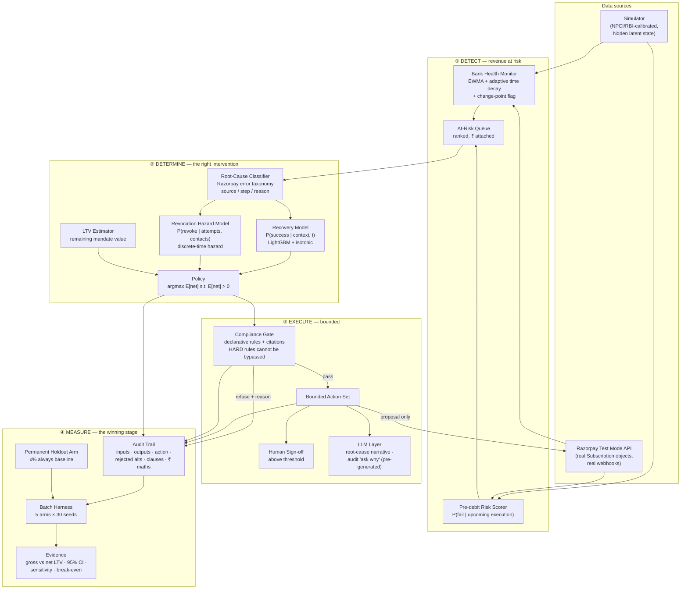

<h1>Dobara <sub><sup>दोबारा</sup></sub></h1>

**Recover the payment. Keep the mandate.**

An AI revenue-recovery agent for Indian recurring payments.
Submission for the **Razorpay AI Buildathon — Track 03: AI Revenue Recovery**.

## What I built

Every retry of a failed recurring payment in India legally requires its own 24-hour
warning message. Dobara treats each retry as a priced bet against losing the mandate
entirely, rather than a free action. **As of the current calibrator (Platt, adopted
2026-09-02), it currently LOSES to Razorpay's own default retry policy on net value
recovered** — ₹64.09/mandate [95% CI −₹81.50, −₹48.65], a real, significant, reported
reversal, not hidden — while still cutting mandate revocations from 1,049 [95% CI 1,040,
1,057] to 716 [708, 726] per seed, a smaller cut than an earlier calibrator achieved
(Honest metrics, below, has the full account of why). It's a working system: a
simulator, three trained/calibrated ML models, a structurally-enforced compliance gate,
a full audit trail, and a batch evaluation harness — not a slide deck, and this README
reports the current negative result exactly as prominently as it would report a win.

**Live: [dobara-one.vercel.app](https://dobara-one.vercel.app)** — the three strongest
reads for a judge short on time: [`/`](https://dobara-one.vercel.app) (the thesis and a
real mandate's aggressive-vs-Dobara replay), [`/evidence`](https://dobara-one.vercel.app/evidence)
(the full result, CIs, sensitivity and break-even), [`/architecture`](https://dobara-one.vercel.app/architecture)
(the LLM boundary and the compliance gate, plus a short note from me). Two worked
decisions if you want to go deeper: [`/audit/89`](https://dobara-one.vercel.app/audit/89)
(rejected alternatives and all) and [`/audit/144`](https://dobara-one.vercel.app/audit/144)
(an abstain — the agent declining to guess).

The rest of this README goes deep on method, and volunteers its own limitations —
[jump straight there](#the-mechanism-nobody-prices) if that's what you're here for, or
keep reading for how it was built and how to run it.

## A note from the builder

I'm Jay Gautam, and I built this alone for this submission. The thing I'm most honest
about: partway through, I found that 76% of the agent's decisions were landing on an
exact tie at the top of its scoring — silently broken by loop order, not by any real
rule, because an isotonic probability calibrator was too coarse to preserve a day-of-week
signal the underlying model had genuinely learned. I diagnosed the actual cause before
touching a fix, wrote down a commitment to report the headline result honestly either
way *before* rerunning it, and then reran — the number moved by ₹0.28 per mandate, not a
regression, but I didn't know that going in. Full account in
[`docs/DECISIONS.md`](docs/DECISIONS.md) under `[2026-08-27]`, "Three findings from a
static review."

## How this was built

**Stack, and why:** Python (uv, LightGBM + isotonic calibration, pandas) for the
simulator, models, and agent — tabular and inspectable was a requirement, not a
preference, so nothing here reaches for a neural net where a calibrated GBM does the
job. Next.js (App Router, static export) for the frontend, because the deployed demo
needed to run with no server and no API key — every route reads committed JSON
artifacts, never a live model call. FastAPI exists for local development
(`make api`) but the deployed site doesn't depend on it. Full reasoning for every choice,
including what was rejected and why, is in
[`docs/03-TECH-STACK.md`](docs/03-TECH-STACK.md).

**Deliberately not built:** no real-time serving path (the demo is batch and
artifact-driven — a real deployment would need one), no multi-merchant tenancy, no
handling of actual funds movement (Dobara proposes, a licensed aggregator would
execute), and no live LLM call in production (narratives are pre-generated offline; see
the "ask why" section below for why).

**What would come next with more time:** the `SBI`-slice finding in the metrics
below — Dobara correctly detects a bank-specific failure-rate shift but currently
responds by abstaining entirely rather than scaling back attempts, which is safe but
leaves recoverable value on the table; deciding between those two responses is scoped
out of this submission but flagged in `docs/DECISIONS.md` as the next real lever. Beyond
that: a real (not simulated) calibration dataset, and testing the compliance gate
against RBI's FREE-AI framework with an actual compliance reviewer rather than my own
reading of the primary sources.

> No number appears in this README that is not read from `artifacts/summary.json`.

## Run it

```bash
git clone https://github.com/jaygautam-creator/Dobara && cd Dobara
make setup
make demo     # sim → train → eval → api + web
```

Works on a clean machine with **no API keys and no cloud account**. LLM outputs
(`artifacts/llm_cache/ask_why.json`) are pre-generated and committed; the deployed demo
and this clone both serve committed artifacts, never a live model call.

Regenerating the ask-why cache itself is the one step that needs a key, and it's optional
— everything else runs without it:

```bash
GROQ_API_KEY=... make ask-why   # or GEMINI_API_KEY=...
```

Resumable: only fills in decisions missing from the cache, so an interrupted run picks
back up rather than re-spending calls already made.

---

## The full method

Everything below is the detailed, falsifiable case for the headline result — including
where it's weakest. Volunteering the limitations is the point: read on if you want to
audit the claim rather than take it on faith.

---

## The problem

> **More than 20 million UPI AutoPay mandates are revoked every month in India** because
> the customer's account lacked balance when the debit ran.
> — [Business Standard](https://www.business-standard.com/finance/news/upi-autopay-revocations-hit-20-mn-monthly-over-low-customer-balances-125090700500_1.html)

The failed debit is not the loss. **It is the trigger.** Debit fails → customer is
notified → customer opens their UPI app and kills the mandate → the merchant loses not
this month's ₹499 but every future ₹499.

## The mechanism nobody prices

> **In India a retry requires its own fresh 24-hour pre-debit notification. Retries that
> skip it are rejected outright at the rail — not soft-declined.**

So you cannot retry silently. You cannot retry faster than 24 hours. And **eight retries
means eight mandatory messages** telling a customer that this merchant keeps failing to
take their money.

The standard dunning playbook — retry aggressively, up to eight attempts — is, under Indian
regulation, **a legally-mandated harassment machine**. The regulator forced the retry to be
loud and nobody redesigned the strategy around it.

### Therefore

> **Every retry is a bet with downside. Retrying harder can lose more money than not
> retrying at all.**

Dobara prices that bet:

```
E[net | action] = P(success | t) × amount
                − P(revoke | attempts+1, contacts) × LTV_remaining
                − cost(channel)
```

It acts on the argmax, and **stops when the expression goes negative** — a stopping rule
with a rupee behind it rather than an arbitrary attempt cap.

---

## What it does

**① Detects** revenue at risk — bank-health monitoring with adaptive time decay, plus
pre-debit risk scoring, producing a ranked queue with rupees attached *before* anything fails.

**② Determines** the intervention — root-cause classification over Razorpay's real error
taxonomy, then a policy over a bounded action set scored on expected net lifetime value.

**③ Executes** a bounded workflow — every action passes a declarative compliance gate whose
rules carry their citations; nothing above the sign-off threshold runs autonomously.

**④ Measures** — five arms, thirty seeds, paired confidence intervals, sensitivity analysis,
and a stated break-even condition under which my conclusion would flip.

### Architecture, in one frame



Money decisions (the `POL` policy node) never pass through the LLM layer — enforced by an
import boundary, not just convention (`tests/test_no_llm_in_money_path.py`). Full module
contracts: [`docs/02-ARCHITECTURE.md`](docs/02-ARCHITECTURE.md).

---

## Honest metrics

*(read from `artifacts/summary.json`, 30 seeds x 5,000 mandates/seed, generated by
`make eval` on 2026-08-27 (rerun after `agent/decide.py`'s tie-break fix,
`docs/DECISIONS.md` [2026-08-27] — the 2026-08-26 run this table quoted before is
superseded, not because it was found wrong, but because it was measured under a policy
that no longer exists) — every figure below is quoted verbatim, not hand-typed)*

| Arm | Gross ₹ recovered | Net LTV (total, 30 seeds) | Attempts (mean) | Notifications | Revocations |
|---|---|---|---|---|---|
| `do_nothing` | ₹0 | ₹0 | 0.00 | 0 | 0 |
| `razorpay_default` | ₹25,072,658 [24,941,494, 25,218,567] | ₹22,658,150 [22,514,345, 22,815,206] | 8.42 | 42,110 [42,047, 42,168] | 1,049 [1,040, 1,057] |
| `aggressive_8x` | ₹24,674,228 [24,541,037, 24,802,164] | ₹21,510,625 [21,354,397, 21,661,268] | 8.52 | 42,587 [42,507, 42,668] | 1,353 [1,341, 1,363] |
| **`dobara`** | ₹23,952,261 [23,848,085, 24,069,417] | **₹22,337,706 [22,235,793, 22,449,259]** | 7.80 | 39,175 [39,134, 39,222] | **716 [708, 726]** |
| `oracle` | ₹26,093,076 [25,940,986, 26,261,183] | ₹24,864,706 [24,704,211, 25,045,958] | 8.31 | 41,534 [41,485, 41,586] | 727 [718, 735] |

All values ± 95% bootstrap CI over 30 seeds. Paired comparisons on identical seeds. Only
`dobara`'s row moves when its own decision-time code (`agent/decide.py`, or — as here —
its calibrator) changes; the other four arms never call `decide()`, so they stay
bit-identical run over run (confirmed).

**Headline, current: `dobara` LOSES to `razorpay_default` by ₹64.09 per mandate [95%
CI −₹81.50 to −₹48.65], paired difference across 30 seeds of 5,000 mandates each, CI
excludes zero, significant.** (The table above states this as a −₹320,444
[−₹407,481, −₹243,240] *total* over one seed's 5,000-mandate population — the same
number, same unit, before dividing by 5,000.) This is a **reversal**, not a rerun-noise
move — `dobara` won by +₹65.71/mandate as recently as the previous headline below, and
now loses by a comparable margin, both significant. `oracle` (perfect foresight, the
ceiling) still weakly dominates every arm, confirming the harness itself is sound — no
arm can beat the arm that knows the true probabilities; `dobara` losing to
`razorpay_default` is not a harness bug, it is `dobara` actually performing worse under
its current (Platt-calibrated) policy.

**Why the headline reversed — the calibrator adoption that caused it, reported at full
weight per its own pre-registered commitment, exactly like the rerun below.** The
recovery model's calibrator was switched from isotonic regression to Platt scaling on
2026-09-02, adopted because both pre-registered bake-off criteria (Brier-CI overlap,
argmax tie rate at least halved) passed by a wide margin, directly measured on the
held-out population (`docs/DECISIONS.md` [2026-09-01] "Calibrator bake-off verdict
reversed on the held-out population"; the pre-registration itself:
`docs/DECISIONS.md` [2026-09-01] "Pre-registration: calibrator bake-off"). The
adoption's own commitment — "the calibrator is kept, no re-run hunting a better number,
no criterion added after the fact" — is honored here: **the headline fell, is reported
as such, and the calibrator was not reverted.** Mechanism, as far as this session traced
it (not chased further — see `docs/DECISIONS.md` [2026-09-02] "Platt adopted"): with
isotonic's coarse calibrator, 74.9-77.2% of decisions were exact ties, resolved by
`agent/decide.py::_tie_break_score`'s restraint-first date selection; under Platt, the
tie rate falls to 15.2-17.9% and the now-differentiated calibrated score picks the date
directly on the vast majority of decisions instead. In aggregate, the calibrator's own
picks recover **less** gross (₹23.95M vs. `razorpay_default`'s ₹25.07M, a ₹1.12M gap —
wider than the old ₹743,665 gap) while cutting **fewer** revocations proportionally
(716 vs. 1,049, a 31.7% cut — smaller than the old 39% cut, 638 vs. 1,049) than the
tie-break's picks did on that same share of decisions. The smaller revocation-avoidance
gain no longer outweighs the larger gross-recovery loss, flipping net LTV negative. A
specific causal account of why continuous Platt-driven date selection underperforms
restraint-first tie-break selection is not established — flagged as follow-up work,
not resolved here.

**The original tie-break fix, for history — this is a rerun of a rerun, and the number
was pre-registered both times.** `184f157` (2026-08-27) fixed a real bug: 76% of
`dobara`'s decisions had an exact tie at the argmax (`docs/DECISIONS.md` [2026-08-27]
has the full diagnosis — an isotonic calibrator with only 17 distinct output values
collapsing genuine day-of-month/day-of-week model signal), resolved until then by
accident of candidate-list order, not by any rule. That rerun moved the headline
₹65.99 → ₹65.71/mandate, a rounding-level change. The calibrator-adoption rerun above is
the second such pre-registered, commit-before-you-measure rerun on this same headline,
and moved it far more — a sign reversal, not a rounding change — reported with the same
discipline both times.

**Two follow-up findings on the same tie rate, investigated 2026-09-01 — the adoption
verdict below was corrected the same day once the right population was checked, and
has since been acted on (above).** First, a four-calibrator bake-off (isotonic, Platt,
beta, monotone spline — `scripts/calibrator_bakeoff.py`) tested whether a smoother
calibrator would meaningfully cut the tie rate against the pre-registered bar (halve the
tie rate without hurting calibration). On the bake-off script's own default sample —
n=300, the recovery model's *own training seed*, never sanctioned by the
pre-registration as the evaluation population — no candidate met the bar. But measured
directly on the held-out world (`api/demo.py`'s `DEMO_SEED=9001`, the population every
other number on this page uses), **Platt and beta both clear both pre-registered bars
by a wide margin**: tie rate 30.4%/74.9% (well under the 37.5% halve-bar) and Brier CI
overlapping isotonic's, on both the `attempt_index_1_only` (n=1,173) and full-lifecycle
(n=1,304) slices. **The pre-registered rule said adopt Platt or beta, and Platt has now
been adopted** (`docs/DECISIONS.md` [2026-09-02] "Platt adopted") — this page's headline
above already reflects it. Full reversal and the ordering of how it was found (a
seed-disclosure correction surfaced the representative population first, the verdict
implication was noticed only after): `docs/DECISIONS.md` [2026-09-01] "Calibrator
bake-off verdict reversed on the held-out population."

Second: **a majority of ties trace to the calibrator's own quantization, not the raw,
uncalibrated model score** — on the held-out, representative population. Swapping in a
fully continuous calibrator (Platt/beta, 5,000 distinct outputs, zero quantization) still
leaves some decisions tied, because the raw model score already ties before calibration
runs — but on held-out data that's the minority cause, not the majority; the
training-seed sample above and the raw-score story below invert that story, which is
why leading with the training-seed reading (as an earlier version of this page did) was
the wrong lead — kept here now for contrast, not as the headline. Measured two ways,
same production model, same production (full-validate-fit) isotonic calibrator
throughout:

| Population | n | Raw-score-only tie rate | Total (calibrated) tie rate | Share of ties already in the raw score |
|---|---|---|---|---|
| Held-out eval world (`api/demo.py`'s `DEMO_SEED=9001`) — first attempt of every cycle across a mandate's full lifecycle, the representative population | 1,173 | 30.4% (357/1,173) | 74.9% (878/1,173) | 40.7% (357/878) — **calibrator causes the majority (~59%)** |
| Contrast only — bake-off script's own sample: mandate's first cycle only, `world_seed=42`, the recovery model's *own training seed*, not held out | 300 | 60.7% (182/300) | 89.7% (269/300) | 67.7% (182/269) — raw score is the majority here |

The raw-score *resolution* — the mean fraction of `ScheduleDebit` candidates (day ×
channel) in one decision's window that get a distinct raw score — is stable across both
populations (23.1% training-seed, 23.5% held-out out of a mean 87 candidates per
decision), confirming the underlying tree-ensemble quantization is a real, reproducible
property of the model, not a training-seed artifact. But *how often that quantization
lands exactly on the argmax* is not stable — it's roughly two-thirds of ties on the
training-seed sample and roughly two-fifths on the held-out world, the reverse
ordering. `docs/DECISIONS.md` [2026-09-01] "Raw-score tie decomposition" has the full
breakdown; `artifacts/calibrator_bakeoff.json`'s
`raw_score_tie_decomposition` and `population_reconciliation.held_out_raw_score_tie_decomposition`
carry both populations' numbers with n's, so neither figure can be read without the other.

What doesn't move between the two populations: `day_of_month` carries real, substantial
learned signal (gain rank 4 of 26 features, computed directly from the persisted
booster's own `feature_importance('gain')` — not hand-copied — split at near-single-day
resolution across the forest) and the ensemble's realized per-candidate resolution stays
around 23% either way. That is the finding that stands: this is a genuine
model-granularity limitation, not the restraint design working as intended — the model
has a preference it can't fully express, not no preference at all. What does move is how
often that limitation happens to decide the *specific* argmax, which is a property of the
population being decided over, not of the model alone
(`docs/DECISIONS.md` [2026-09-01] "Raw-score tie decomposition").

**No longer below Razorpay's own credibility anchor — a loss, not a small lift, and
reported that way.** −₹320,444 on `razorpay_default`'s ₹22.66M net-LTV base is a
**−1.41% lift** (a loss, magnitude comparable to the old +1.45% win). The
[4-6% success-rate lift](https://arxiv.org/abs/2111.00783) anchor Razorpay's own
production routing system reports exists to catch an implausibly LARGE win, not to bless
a small loss — it has nothing useful to say about this result, and this section is not
going to reach for it as reassurance. A negative, significant headline on a project whose
one-sentence thesis is "recover the payment, keep the mandate" is the finding, stated
plainly, not a number to explain away with an anchor built for a different failure mode.

**The mechanism, decomposed** — this is the clearest statement of what's currently going
wrong, not asserted:

| | Rs., 5,000-mandate seed |
|---|---:|
| Gross recovery given up (`dobara` attempts less, more selectively) | −₹1,120,397 |
| Mandate value bought back (fewer revocations, fewer notifications) | +₹799,953 |
| **Net** | **−₹320,444** |

`dobara` recovers *less* gross (₹23.95M vs. `razorpay_default`'s ₹25.07M — 7.80 vs 8.42
mean attempts, 39,175 vs 42,110 notifications) and now the gross given up is LARGER than
under the old isotonic calibrator (₹1,120,397 vs. the old ₹743,665), while the
revocation cut that used to more than cover it has shrunk: **31.7%** (716 vs 1,049),
down from the old 39% (638 vs 1,049) — `dobara` now avoids fewer revocations, not more,
even though the tie rate (and therefore how often the tie-break's restraint-first date
selection used to run instead of the calibrator's own pick) fell sharply. The two
effects both moved the wrong way at once: bigger gross loss, smaller revocation-avoidance
gain, and the gain no longer covers the loss. `aggressive_8x` still shows the same
crossover inverted, unaffected by this session's changes: more gross than `dobara`
(₹24.67M) but the worst net LTV of any retrying arm (₹21.51M, a significant ₹1.15M loss
vs. `razorpay_default`) — more retries, more notifications, more revocations, exactly
the mechanism this project is built to price. `dobara` no longer sits cleanly on the
other side of that trade-off from `aggressive_8x` the way it did under isotonic; it has
moved partway toward it.

**Two lift estimates appear in `artifacts/summary.json`; they measure different things,
and only one is the headline — both now negative, consistently.** The paired comparison
above (−₹64.09/mandate [−₹81.50, −₹48.65]) is the arm-level
`dobara`-vs-`razorpay_default` difference, seed-bootstrapped, with a valid CI — **this is
the headline number.** `permanent_holdout_arm` reports a second figure: `dobara`'s served
population (n=135,299, live `decide()`) averaging ₹4,463.02/mandate against its own
same-world holdout control (n=14,701, routed through `razorpay_default`'s cadence
instead) averaging ₹4,509.19/mandate — now a **−₹46.17/mandate** gap, the same direction
as the headline. These are not in conflict; they differ by construction, as before. The
holdout figure is a cleaner served-vs-control design (same seed, same population, no
cross-arm dilution) but is **pooled across all 30 seeds with no seed-level bootstrap
CI** — a point estimate, not a confidence interval. The paired headline's denominator, by
contrast, is *every* mandate in `dobara`'s arm, including the ~10% internally routed to
the holdout control (which, using identical per-mandate RNG draws to the standalone
`razorpay_default` arm, contribute ~0 to the paired numerator by construction) — so the
same underlying effect is spread over a denominator that includes mandates the effect
didn't touch. **Read them as: −₹64.09/mandate, CI-backed, is the number to quote;
−₹46.17/mandate is a directionally consistent, uncertainty-unquantified second read of
the same underlying effect, not a competing estimate.**

**Bank-level slices are directional, not a second headline.** Per
`artifacts/summary.json`'s own `robustness_slices.note`: these are pooled across all 30
seeds' mandate rows, not independently seed-bootstrapped — no valid CI exists at the slice
level, and none is shown below. Read magnitude and direction, not precision.

**`SBI` restraint is still real and still working — but it is no longer the whole
story, and saying so plainly matters more now than it did when the headline was
positive.** `SBI` is the one bank carrying a real, *injected* mid-mandate failure-rate
shift (`sim/params.yaml`'s `regime_shift` block, test-window only, by construction). The
`bank_health_changepoint` detector catches it — 63-66% recall, 84-88% precision against the
known injected regime, measured `[2026-08-26]` and unaffected by this session's
calibrator change (the detector doesn't depend on the recovery model) — and `dobara`
correctly declines to trust its own recovery-model score there, exactly the
graceful-failure design in `docs/06-AGENT-SPEC.md`. That restraint still has a real,
measured price, now larger: on `SBI` specifically (directional slice, no CI, see above),
`dobara`'s mean net LTV/mandate (₹3,586) runs **₹731.95** below `razorpay_default`'s
(₹4,318) even as `SBI`-specific revocations are still cut by more than half (**56.4%**,
2,275 vs 5,219). **But the 7 unshifted banks — where the model IS trusted, and `SBI`
restraint has no bearing — now barely win at all**: ₹4,592 vs. ₹4,562/mandate, a
**₹30.55** gap, down from the old ₹166/mandate margin. The old story ("a real, priced
restraint cost on `SBI` and a real win everywhere else") is no longer accurate: the
non-`SBI` win nearly vanished too, meaning the reversal is not localized to the
known-shifted bank — it is broad, consistent with the mechanism section above (worse
date selection generally, not a `SBI`-specific effect). The next lever isn't detection
(already measured as working, unaffected here) — it's now, more urgently than before,
whether Platt-calibrated date selection itself needs a different tie-break or scoring
adjustment; flagged for a future session, not fixed here.

## The money chart

> **Known gap, flagged not hidden (`docs/DECISIONS.md` [2026-08-27], still open as of
> the 2026-09-02 Platt adoption):** this static SVG has no committed regeneration
> script — it predates `scripts/build_money_chart.py` (which only writes
> `artifacts/money_chart_data.json`, the live web chart's data source, regenerated this
> session) and was never wired into `check_artifact_freshness.py` for exactly that
> reason. **It still shows the pre-Platt (winning) trajectory and was NOT regenerated
> this session** — read it as illustrating the *shape* of the gross-vs-net mechanism
> only, not this session's actual numbers; the live `/evidence` money chart (built from
> the regenerated `money_chart_data.json`) is current and should be trusted over this
> image for anything numeric.


*(single seed 301, n=5,000 mandates, held out from both training and the eval harness's
30 seeds — illustrates the mechanism's shape over time; the seed-bootstrapped headline is
the "Honest metrics" table above, not this chart)*

**Not the crossover the spec assumed — a different, still honest, finding.**
`docs/07-EVAL-SPEC.md` expected `aggressive_8x` to lead on gross the whole horizon and
cross below on net partway through. The actual single-seed replay shows something more
specific: `aggressive_8x` trails **both** `razorpay_default` and `dobara` on net LTV from
**cycle 1** — there is no mid-horizon crossover moment on net, only a gap that opens
immediately and widens every cycle (₹1.14M behind `razorpay_default` and ₹1.48M behind
`dobara` by cycle 8). And `aggressive_8x`'s own gross lead doesn't even hold up against
`razorpay_default` for the full horizon: it's ahead through cycle 4, then
`razorpay_default`'s gross overtakes it from cycle 5 onward — revoked mandates stop
contributing future gross too, so `aggressive_8x`'s early gross lead erodes on its own
terms, not just on net. It does stay ahead of `dobara` on gross throughout (fewer attempts
by design). Reported as observed, not forced into the assumed shape.

## Break-even reporting

State the value of `revocation.hazard_per_failure_notification` at which `aggressive_8x`
would beat `dobara` on net LTV, and say whether the real-world value plausibly sits
there — `docs/07-EVAL-SPEC.md`'s own words for why this section exists: "naming the
condition under which you are wrong is the strongest credibility signal available in a
repo of this kind."

*(`python -m eval.sensitivity`, single seed 301, n=5,000 mandates, 5 points across the
declared `sensitivity_range` [0.05, 0.15] — read from `artifacts/sensitivity.json`)*

**Against `aggressive_8x`: no break-even found anywhere in the declared range.**
`dobara` beats `aggressive_8x` on net LTV at every tested point, 0.05 through 0.15 — the
"obvious agent" never catches up across the full stated uncertainty in this parameter.
This is the comparison `docs/07-EVAL-SPEC.md` asks for by name, and it holds robustly.

**Against `razorpay_default`: a break-even now exists INSIDE the declared range, and the
calibrated value sits on the LOSING side of it — the reverse of every previous revision
of this section.** `dobara` now loses to `razorpay_default` at the bottom of the declared
`sensitivity_range` [0.05, 0.15] (by ₹169.48/mandate at hazard=0.05, narrowing to
₹47.44/mandate at hazard=0.100) and only starts winning from **hazard ≈ 0.122** upward
(₹6.53/mandate at 0.125, widening to ₹53.07/mandate at 0.15). Interpolating between the
two swept points bracketing the crossing (0.100, 0.125): **break-even ≈ 0.1220**. The
calibrated value, **0.098** (empirically recalibrated to hit the published
20M-revocations/808M-executions ≈ 2.5% ratio from real NPCI figures —
`revocation_per_execution_ratio`, `sim.engine.SimSummary`, `tests/test_calibration.py`'s
own benchmark), now sits **below** this break-even, by about **20%** — on the LOSING
side, not the winning side an earlier revision of this README reported (hazard ≈ 0.0371,
found only by widening past the declared range; `dobara` won at every point *inside* the
range back then). Judged against the external NPCI anchor rather than the calibrated
point alone: `razorpay_default`'s own `revocation_per_execution_ratio` at this new
break-even hazard is **≈2.79%** — close to, and just above, NPCI's published **≈2.5%**
figure. Read plainly: at the real-world-anchored calibrated hazard value, `dobara`
currently loses to the naive `razorpay_default` policy, and would need real-world
revocation risk to run somewhat ABOVE NPCI's published rate before its current policy
would win. **The extended search past the declared range** (`eval/sensitivity.py`'s
`search_break_even_vs_razorpay_default`, toward the same physical bounds as before: 0.0
for hazard, since the break-even and losing region are now inside the declared range
rather than below it) **found no further inversion between 0.05 and 0.0** — `dobara`
loses at every point in that extended, lower-hazard region too, consistent with the
in-range finding above (dobara loses at hazard <= ~0.122, including all the way down to
0). `artifacts/sensitivity.json`'s `extended_break_even_search_vs_razorpay_default` key
carries this search's full detail.

**The other three declared axes, swept the same way** (`python -m eval.sensitivity`,
same seed and population, `artifacts/sensitivity.json`'s `other_axes`) — **all three now
show `razorpay_default` winning at every tested point, the reverse of every previous
revision of this section**, consistent with the reversal on the hazard axis above:

- **`date_change_offer.response_rate` [0.0, 0.15], including the required 0% run:**
  `razorpay_default` now beats `dobara` at every tested point, including exactly 0% —
  the ranking does not depend on the date-change mechanic working at all, in either
  direction. The declared range's own floor (0%) already is the physical floor (a
  response rate cannot go negative), so there is no further direction to widen the
  search in.
- **`notification.cost_inr.whatsapp` [0.2, 0.6]:** no measurable effect on the ranking at
  any tested point inside the declared range — WhatsApp notifications are too small a
  share of total spend for this range to matter, as before. `razorpay_default` wins at
  every point across the declared range. The extended search (see below) widened this
  down to **₹0 (free notifications)** and still found no inversion — `razorpay_default`
  keeps winning all the way to the edge of what the parameter can mean.
- **`ltv.margin_factor` [0.4, 0.9]** (swept in place of `ltv.horizon_cycles`, which
  `sim/params.yaml` declares with a fixed source, not a `sensitivity_range` — this is the
  actual LTV-dollar-conversion assumption docs/05-ML-SPEC.md's own note flags for this
  analysis): `razorpay_default` now wins on net LTV at every tested point in the declared
  range, 0.4 through 0.9 (a margin gap from ₹127.22/mandate at 0.4 narrowing to
  ₹7.64/mandate at 0.9 — `dobara` gets closer to competitive as margin, and therefore
  the value of avoiding a revocation, rises, but never crosses inside the declared
  range).

  **The extended search widened this axis down toward the point past which "gross
  margin" stops meaning anything** (a merchant with 0% or negative margin has no viable
  subscription business; the search floor is **0.02**, an extreme 2% margin, not exactly
  0 to keep the LTV arithmetic well-defined). `razorpay_default` keeps winning all the
  way down to that floor too — no inversion found in either direction from the declared
  range's own edge. Every number in this bullet is sensitive to the next `make eval`/
  `python -m eval.sensitivity` rerun and must be re-read against the live artifact before
  being restated.

**Extended break-even search — widening past the declared ranges toward a physical or
economic bound**, run separately from the declared-range sweep above and read from
`artifacts/sensitivity.json`'s own `extended_break_even_search_vs_razorpay_default` key
(`eval/sensitivity.py`'s `search_break_even_vs_razorpay_default`, `PHYSICAL_SEARCH_BOUND`
states the bound and reasoning per axis). `sim/params.yaml`'s declared `sensitivity_range`
values are themselves untouched by this search and remain the honest plausible range other
code reads — this is a separate, explicitly-labelled pass to answer the question a range
that never inverts cannot: how far away is the boundary, really?

| Axis | Declared range | Calibrated value | Searched to | Result |
|---|---|---|---|---|
| `revocation.hazard_per_failure_notification` | [0.05, 0.15] | 0.098 | 0.0 (physical floor) | **Break-even at hazard ≈ 0.1220, INSIDE the declared range** (not found by widening past it, unlike every previous revision of this table). Calibrated value sits ~20% BELOW break-even — on the losing side. `razorpay_default`'s revocation ratio at this break-even is ≈2.79%, just above NPCI's published ≈2.5%. Extended search below the declared range (down to 0.0) found `dobara` losing throughout too — no further inversion. |
| `ltv.margin_factor` | [0.4, 0.9] | 0.7 | 0.02 (2% gross margin, economic floor) | `razorpay_default` wins throughout the declared range and down to the floor — no inversion found. |
| `notification.cost_inr.whatsapp` | [0.2, 0.6] | 0.35 | 0.0 (free) | `razorpay_default` wins throughout the declared range and down to the floor — no inversion found. |
| `date_change_offer.response_rate` | [0.0, 0.15] | 0.06 | 0.0 (declared floor = physical floor) | `razorpay_default` wins throughout; nothing further to search — already at the only meaningful bound. |

**Calibration is reported before AUC.** These probabilities get multiplied by rupees, so
being right about the number matters more than ranking. Brier scores and reliability
diagrams for both models are in `/evidence`.

---

## Honesty statement

**The data is simulated, and here is why.** No public dataset of failed payments with retry
outcomes exists — processors do not release it. So I built a simulator whose every
parameter carries a `source:` field pointing at NPCI decline statistics, RBI e-mandate
rules, Razorpay's published documentation, or a declared assumption with a sensitivity
range. Parameters I could not source are listed in the assumptions table below.

Critically, **the simulator holds latent state the agent can never observe** — each
customer's balance process is hidden from every feature, enforced by test. Without that,
the agent would learn its own generator and the evaluation would be circular.

The test set is touched once. The evaluation count is recorded in `artifacts/summary.json`.

### Circularity and what these numbers can and cannot show

I caught myself making exactly the mistake the paragraph above exists to prevent, and
I'm naming it here rather than letting a reviewer find it first.

The revocation hazard model's headline result — predicted hazard rising 0.113 → 0.130 →
0.207 as same-cycle failure count goes 0 → 1 → 2 — **does not empirically confirm the
thesis.** `sim/params.yaml`'s `revocation.hazard_per_failure_notification` is a declared
`assumption` (recalibrated 2026-08-25 against the revocations/execution target ratio
below). The rising-hazard-with-failures relationship was authored into the simulator by
hand. The hazard model recovering it is not evidence about the world — it's evidence that
the model is correctly specified and can recover a known relationship from data. That's a
real and useful result, but it validates the *model*, not the *thesis*.

**What the result actually shows:** the hazard model works as intended — discrete-time,
calibrated, and able to recover a planted signal cleanly.

**What actually supports the thesis** — none of it a fitted parameter:

1. **The regulatory mechanism.** Every retry legally requires its own fresh 24-hour
   pre-debit notification (`docs/01-REGULATORY.md`, RBI-PDN-24H). Retry volume mechanically
   drives notification volume; this is a rule, not a model output.
2. **The published NPCI figures.** ~20 million AutoPay revocations against ~808 million
   executions per month (Business Standard, 2025, pinned in
   [`docs/04-DATA-MODEL.md`](docs/04-DATA-MODEL.md#calibration-anchors-real-cited)).
3. **Those revocations are attributed, in the source, to low customer balance** — the
   population a harassment-driven retry strategy is most likely to push over the edge.

**The defensible empirical claim**, to be established in Phase 4 rather than assumed here:
across the *full* declared `sensitivity_range` [0.05, 0.15] of
`hazard_per_failure_notification`, Dobara beats the `aggressive_8x` arm on net lifetime
value — plus the break-even value of that parameter below which `aggressive_8x` would win
instead. That comparison is falsifiable by construction: it's checked across the whole
plausible range of the one assumption doing the work, not at the single value I happened
to calibrate to, and it states the point at which the claim stops holding.

**A concrete example of how I handled a sourcing conflict.** Press coverage disagrees on
AutoPay volume: one recurring figure is "over 120 million mandates created every month,"
another is "50 million new mandates in July 2025." I pinned the latter — 50M new
registrations / 808M executions, July 2025, NPCI data via Business Standard, dated and
paired with a same-source year-on-year comparison — and rejected the 120M figure because
no source traces it to a specific NPCI release or states whether it means new mandates,
active mandates, or monthly executions. Full reasoning in
[`docs/04-DATA-MODEL.md`](docs/04-DATA-MODEL.md#calibration-anchors-real-cited).

### The `/audit` "ask why" box's narratives are generated ahead of time, and the cache is mixed

The deployed site is a static export with no server — there is no runtime to hold an API
key or make an LLM call. So every plain-English explanation in the "ask why" box on
`/audit/[id]` was generated **offline, once, ahead of time**, from that exact decision's
structured audit record (`scripts/generate_ask_why.py`, `make ask-why`), and committed to
`artifacts/llm_cache/ask_why.json`. The narrating model never sees, touches, or influences
the money decision it's explaining — it runs well after `agent/decide.py` has already
logged the outcome, reading only what was already written down.

**The cache is genuinely heterogeneous across providers and models**, and each of the
1,296 entries is stamped individually with which one generated it (`provider`, `model`,
`generated_at` — not a single file-level claim), for the same reason every audit record
carries `model_versions` and every number in this README carries a source. Getting the
full batch through free-tier quotas required switching between Google Gemini and Groq,
and between several models within each, as one free-tier daily budget after another was
exhausted — the blow-by-blow is in
[`docs/DECISIONS.md`](docs/DECISIONS.md) under `[2026-08-28]`. Every narrative is checked
against its own decision's numbers by an automated grounding pass (below) regardless of
which model wrote it, so heterogeneity doesn't mean uneven trust.

---

## What Dobara deliberately does not do

- **No individual cash-flow inference.** Dobara never models a specific person's balance
  or income. Only declared preference, the merchant's own transaction history, and
  aggregate cohort priors. I could have built the balance model. I chose not to. This is a **stated
  commitment**, held up by two different mechanisms: import isolation (`features/` has no
  import path to the simulator's hidden balance process, `sim/latent.py`, enforced by a
  test) and a name-based guard (`assert_no_banned_features` in `features/recovery.py`
  rejects any feature column whose name contains `balance`/`income`/`spend`/etc.). The
  name-based guard catches naming, not semantics — it cannot detect a differently-named
  feature that is *functionally* a balance proxy. It is a backstop and a stated
  commitment, not a proof; the real guarantee is the import boundary plus review.
- **No probing debits.** A ₹1 test debit to detect whether funds exist is technically
  clever, ethically indefensible, and almost certainly breaches the mandate's amount terms.
- **No LLM on the money path.** Probabilities and decisions are tabular, calibrated and
  inspectable. LLMs handle narrative, language and explanation only — enforced by an import
  boundary and a test.
- **No funds handled.** Dobara proposes; a licensed payment aggregator executes.

---

## Compliance

Regulatory rules are implemented as **declarative, cited, structurally-enforced
constraints** — not a paragraph claiming compliance. A `hypothesis` property test asserts
that no generated action can violate a HARD rule.

Mapped to RBI's **FREE-AI** framework (13 Aug 2025) Sutra by Sutra — safety, transparency,
accountability, fairness, inclusivity, sustainability, explainability. Full detail and the
rule table in [`docs/01-REGULATORY.md`](docs/01-REGULATORY.md).

*Not legal advice. Engineering research from public sources. Where a rule is genuinely
ambiguous we take the stricter reading and flag it.*

## Documentation

| | |
|---|---|
| [Thesis](docs/00-THESIS.md) | Why this project, and the insight |
| [Regulatory](docs/01-REGULATORY.md) | Legal clearance; rules as executable spec |
| [Architecture](docs/02-ARCHITECTURE.md) | System design and module contracts |
| [Tech stack](docs/03-TECH-STACK.md) | Every choice, and what was rejected |
| [Data model](docs/04-DATA-MODEL.md) | Schemas and simulator specification |
| [Models](docs/05-ML-SPEC.md) | Features, training, calibration |
| [Agent](docs/06-AGENT-SPEC.md) | Decision layer, compliance gate, audit |
| [Evaluation](docs/07-EVAL-SPEC.md) | Arms, CIs, sensitivity, break-even |

---

*Built for the Razorpay AI Buildathon. Uses Razorpay **test mode** only. Not affiliated
with or endorsed by Razorpay.*
