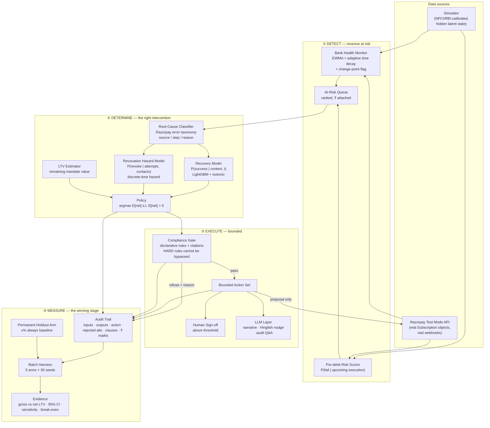

# 02 — System Architecture

Mirrors the brief's three verbs — **detect → determine → execute** — plus a fourth stage,
**measure**, which is where the track is actually won.

The static / dynamic module split deliberately echoes Razorpay's own published architecture
(Bygari et al., IEEE Big Data 2021).



---

## Module contracts

Each module is a package with a typed interface, unit-tested in isolation. Modules
communicate through Pydantic models only — no shared mutable state.

### `sim/` — the simulator
**Owns:** the ground truth. Generates mandates, cycles, attempts, outcomes, revocations.
**Critical invariant:** the simulator holds **latent state the agent can never observe**
(each customer's balance-availability process). The agent sees only what a PSP would see:
debit outcomes, decline reasons, timestamps. *This is what stops the agent from learning
its own generator and makes the evaluation non-circular.*
**Out:** `sim.run(params, seed) -> World`

### `features/` — feature construction
**Owns:** the leakage boundary. Every feature is computed from information available
**strictly before** the decision timestamp. A test asserts no feature reads future rows.
**Refuses:** any feature encoding individual balance or income (rule `DPDP-MINIMISE`).
**Out:** `build_features(world, as_of) -> DataFrame`

### `models/` — the learned components
Three artifacts, all tabular, all calibrated, all inspectable. **No LLM import permitted.**
- `recovery.py` — `P(debit succeeds | context, attempt_time)`
- `revocation.py` — `P(mandate revoked within k days | attempts, contacts, history)`
- `bank_health.py` — EWMA with adaptive decay per `(bank × method)`, plus change-point flag
**Out:** calibrated probability + SHAP-style attribution for the audit line.

### `agent/` — the decision layer
- `decide.py` — the policy. Pure function, no I/O, no LLM. Fully unit-testable.
- `actions.py` — the bounded action set as a closed enum. Nothing outside it can be emitted.
- `compliance.py` — the declarative rule engine. Rules carry `id`, `citation`, `severity`,
  `source_url`. **A HARD failure makes the action unrepresentable**, and the refusal is logged.
- `stopping.py` — the seven named stopping reasons.
- `audit.py` — writes the trail. Append-only. Never mutated.
**Out:** `decide(case, models, config) -> Decision` where `Decision` always carries
`chosen`, `rejected_alternatives`, `clauses_satisfied`, `rupee_math`, `stopping_reason?`.

### `eval/` — the batch harness
Runs all arms over the held-out set across seeds. Emits `artifacts/results.parquet` and
`artifacts/summary.json`. **Every number in the README and UI is read from these files**,
never hand-typed.

### `api/` — FastAPI
Thin. Serves the queue, streams a live batch run over SSE, exposes audit records, proxies
Razorpay test-mode calls. No business logic — it calls `agent/`.

### `web/` — Next.js Control Room
Presentation only. Types generated from the OpenAPI schema.

### `llm/` — the narrative layer
Isolated behind an interface, disk-cached, key-optional. Imported by `api/` and `web/`
paths only — **never by `agent/decide.py`**, and a test enforces that import boundary.

---

## The bounded action set

A closed enum. The agent cannot express anything else.

| Action | Effect | Requires |
|---|---|---|
| `SCHEDULE_DEBIT(t)` | Propose a debit at time `t` | PDN sent ≥24h before `t`; `t` in-window; AFA if >₹15k |
| `SEND_PRE_DEBIT_NOTICE(t, channel)` | The mandated notification, carrying defer + opt-out | Contact hours; DLT/WA template; fatigue cap |
| `OFFER_DATE_CHANGE(t_new)` | Ask once to move the recurring date permanently | Converge rule; fatigue cap |
| `ESCALATE_TO_HUMAN(reason)` | Hand to a person with a written reason | — |
| `STOP(reason)` | Cease recovery on this cycle | One of the seven named reasons |
| `ABSTAIN(reason)` | Model lacks evidence; **stops, does not attempt this cycle** | Logged as low-confidence |

**`ABSTAIN` is the graceful-failure requirement.** When a bank, method or decline reason
has insufficient history, or the calibrated confidence interval on `E[net]` straddles zero,
the agent does not guess — it **stops** and says so (`CLAUDE.md`: "when in doubt, the
agent stops"; overrules this doc's original fall-back-to-default design, see
`docs/DECISIONS.md` [2026-08-25] "Abstain must stop, not fall back to an attempt").

## The decision, formally

```
E[net | a] = P(success | t_a) · amount
           − P(revoke | attempts+1, contacts+n_a, history) · LTV_remaining
           − cost(channel_a, retry_a)

choose  argmax_a E[net | a]
subject to  compliance_gate(a) == PASS
            E[net | a*] > 0     else STOP(negative_expected_value)
            CI_lower(E[net|a*]) > 0  else ABSTAIN(insufficient_confidence)
```

Two consequences, both falling out of the 24-hour rule:

- **Attempts are priced, not just outcomes.** Every attempt forces a notification, so the
  cost lands whether or not the debit succeeds. This mathematically inverts the industry
  default: **fewer, better-placed attempts beat many attempts.**
- **`P(revoke)` rises with attempt count and contact density**, not merely with elapsed
  time. That hazard model is the component nobody else will build.

## The seven stopping reasons

Every `STOP` names exactly one, and it appears in the audit trail and the UI.

1. `HARD_DECLINE` — the decline reason is terminal; retrying cannot help
2. `MANDATE_REVOKED` — nothing left to recover against
3. `CUSTOMER_OPTED_OUT` — the customer used the control we gave them
4. `MAX_ATTEMPTS` — the configured cap for this cycle
5. `COST_CAP` — cumulative recovery spend exceeded its budget
6. `NEGATIVE_EXPECTED_VALUE` — **the derived one**; expected recovery no longer exceeds
   expected revocation cost
7. `INSUFFICIENT_CONFIDENCE` — the model abstained; baseline policy applies

## Data flow at runtime (one case)

1. Bank Health Monitor updates EWMA from the latest outcomes for `(bank × method)`.
2. Pre-debit scorer ranks upcoming executions; at-risk cases enter the queue with ₹ attached.
3. On failure, Root-Cause Classifier maps Razorpay's `source` / `step` / `reason` to one of
   the handled causes.
4. For each candidate action and each candidate time in the legal window, the recovery and
   revocation models score it; LTV supplies the downside multiplier.
5. Policy takes the argmax subject to the gate and the positivity floor.
6. Compliance gate validates; on HARD failure the action is refused and the refusal logged.
7. Action executes as a **proposal** to Razorpay test mode; the LLM composes any customer-
   facing text inside the approved template.
8. Audit line written: inputs, model outputs with attribution, chosen action, **every
   rejected alternative and its `E[net]`**, clauses satisfied, and the rupee arithmetic.

## Non-goals — stated so the scope stays honest

- Not a payment aggregator. Dobara proposes; a licensed PA executes. No funds are handled.
- Not a fraud/risk engine. That is Track 02.
- Not a general dunning suite. One loss class: **failed recurring mandate debits in India.**
- Not a balance-prediction service. Tier 4 is refused.
